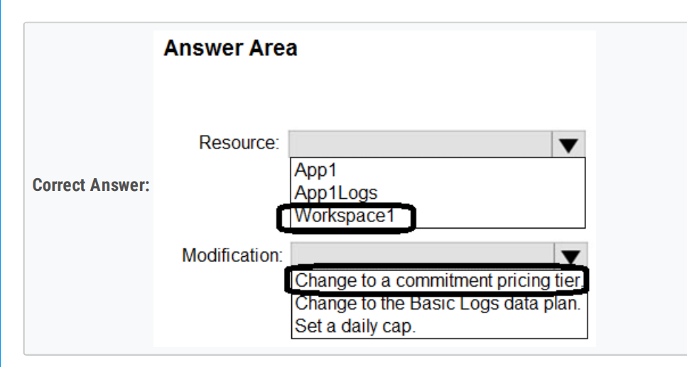
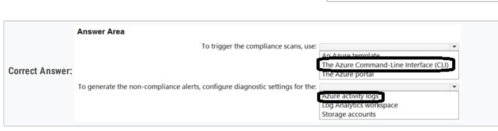

# AZ305 复习 topic 1

AAD IG > AAD IP

**run IP flow == yes**

## 1-30

### HARD: 3,6,17

1、All users are licensed for the **Microsoft 365 E5 plan**. 

== A. In Azure Active Directory (Azure AD), create an **access review of Application**

2、access to the blobs during the month of **April** only.

== A. shared access signatures (SAS)

3、

provide the remote users with single sign-on (SSO) access to WebApp1.

== A. Azure AD Application Proxy

E. Azure AD enterprise applications

4、removed

== C. Create an access review. 

5、

Databrick SKU: Premium

Cluster configuration:  Credential passthrough

#### 6、

The users can connect to App1 **without being prompted** for authentication: An Azure AD app registration

The users can access to app1 only from **company-owned computers**: A conditional Access policy

7，8，9，14、being **allowed or denied** to the virtual machines

== run IP flow

10、

Events from Windows event logs: Event

Events from Linus system logging: Syslog

11、e

12、

Azure AD Application Proxy

an Azure AD enterprise application

a conditional Access policy

13、ARM

Azure Activity Log

15、

AAD audit log  ---> Azure Event Hubs ---> Azure Functions ---> Cosmos DB

16、 

OAuth 2.0 provider\The solution must NOT use **Azure AD guest accounts** 

== D. Azure API Management

17、

Resouce to create in Azure: A Log Analytics workspace

Configuration to perform on the virtual machines: Install the Azue Monitor Agent

18、PIM - MI - PIM

Security: Azure AD Privileged Identity Management (PIM)

Deployment: Azure Managed Identity (MI)

Quality Assurance: Azure AD Privileged Identity Management (PIM)

19、blueprint 

2-2-2

20、

Azure policy effect to use: Modify

Azure AD object and RBAC role to use for the remediation tasks: A managed identity with Contributor role

21、new diagnostic settings

yes yes yes

22、only privileged users can view the **PII**

== A. dynamic data masking

23、 

Encrypt all the data in the storage account by using customer-managed key

== B. **blobs in a general purpose v2 storage account**

24、KV

== 

Key Vault integration method: Key Vault reference in Application settings

Key Vault permissions for the managed identity: Secrets: Get

25、Avoid storing secrets and certificates on the virtual machi

== D. a user-assigned managed iden

26、AS1 CDB1

== C. Azure Synapse Link for Azure Cosmos DB

27、90/730 days

The amount of time that SQLInsights data will be stored in blob storage is: 90 days

The maximum amount of time that SQLinsight data can be stored in Azure Log Analytics is: 730 days

28、

== C. password-based

29、bastion/ Azure Windows VM

To provide access to virtual machines on VNet1, use: Azure Bastion

To enforce Azure MFA, use: A conditional Access policy that has the Cloud apps assignment set to Azure Windows VM sign-in.

30、

environment, owner, department and cost center.

== C. an Azure policy that enforces tagging rules

## 31-60

### HARD: 40，41，**43**，54，55，59，60

31、

D. In the Azure AD tenant of Contoso, create guest accounts for the Fabnkam developers

32、

C. Use Azure AD entitlement management to govern external users.

33、

Grant permissions to allow the web apps to access the web APIs by using: Azure AD

Configure a JSON Web token validation policy by using: APIM

34、000

35、000

36、

an authentication solution for Azure Functions

== B. system-assigned managed identities

37、000

38、000

39、000

40、

Configure App1 to use OAuth2.0: Client credentials grant flows

Configure App1 to use a REST API call to retrieve an authentication token from the: Azure Instance Metadata Service (MDS) endpoint

41、

Configure **Supported account types in the application registration** and update the **sign-in endpoint**. 

42、removed

== C. Create an access review. 

#### 43、

Authenticaton: APP registration in AAD

Authorization: Delegated permissions

44、000

45、000

#### 46、

47、000

48、000

49、 resources can be grouped by department.

== B. Azure Policy and tags

50、000

51、000

52、

User1: User Administrator for MarketingAU

User2: Helpdesk Administrator for MarketingAU

53、000

54、

Storage: Secret

Access: A managed service identity (MSI)

55、

56、000

57、

minimum number of Azure Monitor workspaces 

== A. 1

58、000

#### 59、

Minimum number of Azure AD tenants: 1

Minimum number of conditional access policies to create: 2

60、

Once every 30 days, the project managers must be prompted automatically to verify which users are assigned to their projects.

== D. Azure AD Identity Governance

## 61-68

### HARD: 61,62,63，**65**，66

61、

62、monitor traffic between the App1 components

== B. Application Insights

63、

commitment pricing tier

64、budgets, resource tags

use Microsoft Cost Management to monitor costs on a per project basis

== A. budgets

B. resource tags

65、CLI == Azure Activity logs

#### 66、sas only, aad credentials

67、Monitor data collection == KQL

68、DCR = Monitor agent

