# AZ305 复习 topic 2

## one Azure Service Bus topic > one ADF pipeline

20 == elastic pool

2 == SQL managed instance

## 1-39

### HARD: 1、3、11、12、15、16、22、24、28、33-37

#### 1、

 Stored procedures are implemented by using CLR. The largest database is currently 3 TB. None of the databases will ever exceed 4 TB

== B. Azure SQL Managed Instance

2、store a copy of the company files from Server1 in store1

== B. an Azure Import/Export job

C. Azure Data Factory

3、

the storage account queue to ensure that each additional application will be able to read the relevant transactions.

== D. one Azure Service Bus topic

4、

Storage account type: BlockBlobStorage

Storage service: Blob

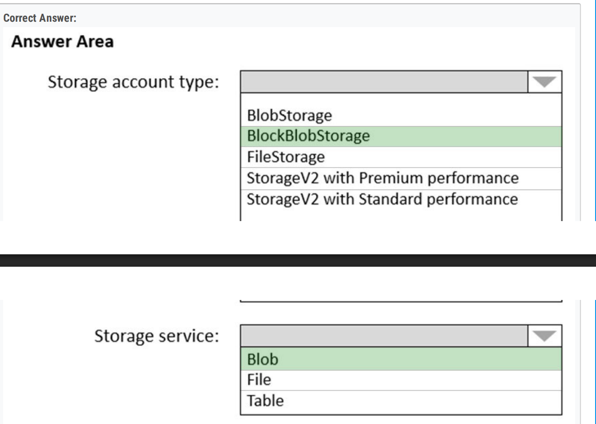

5、

App1: Storage1 and storage3 only

App2: Storage1 and storage4 only

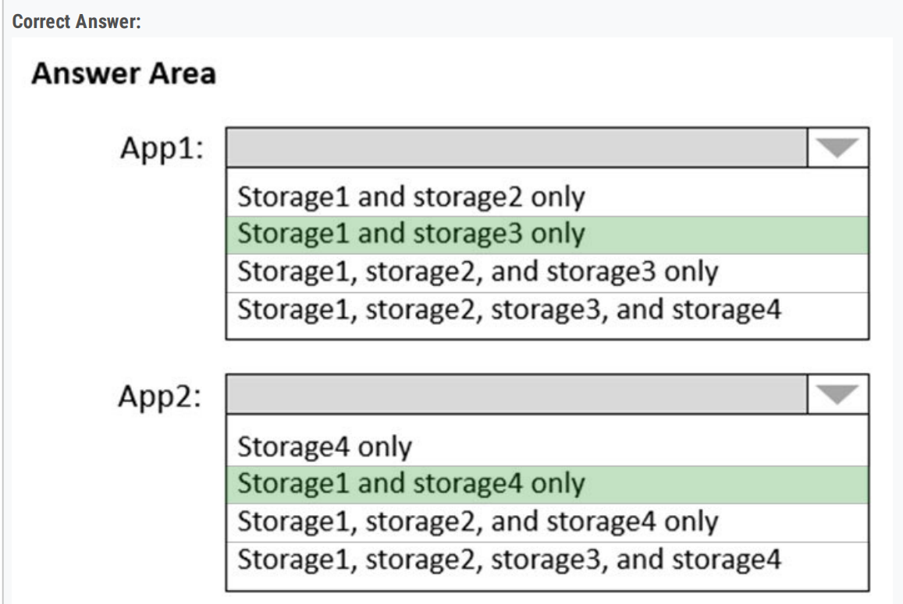

6、

host video files that range from 50 MB to 12 GB

== C. Azure Blob Storage

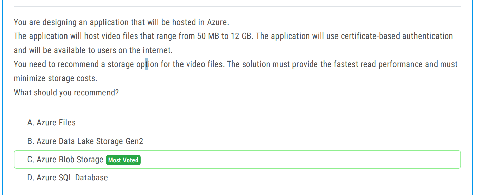

7、

include 20 databases that will be 20 GB each and have varying usage patterns

== A. an elastic pool that contains 20 Azure SQL databases

#### 8、OLTP = SQL DB

Service: Azure SQL Database

Service tier: Hyperscale

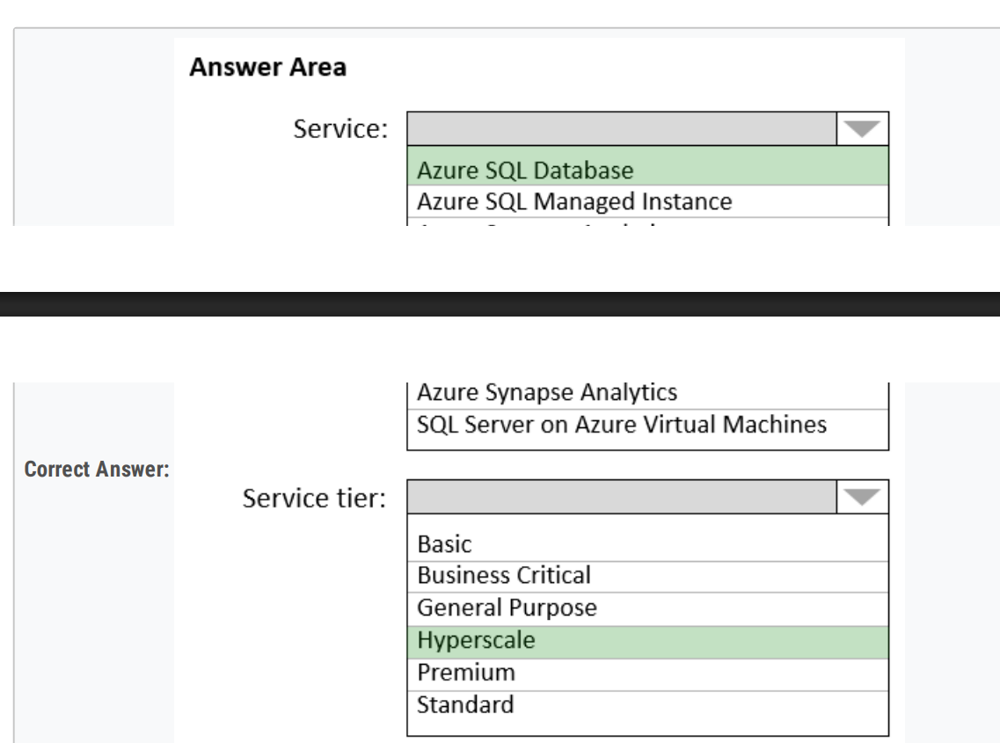

9、

 include 50,000 IoT devices

== C. Azure Cosmos DB SQL API

D. Azure Time Series Insights

10、multi-master writes

== A. Azure Cosmos DB SQL API

#### 11、

When you enable auditing for SQLdb1, you can storage the audit information to storage1. Y

When you enable auditing for SQLdb2, you can storage the audit information to storage2. N

When you enable auditing for SQLdb3, you can storage the audit information to storage2. N

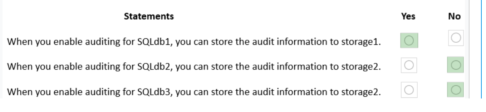

12、

From the SQL Server **2012** database: **Data Migration Assistant**

From the table in the SQL Server **2014** database: **Azure Cosmos DB Data Migration Tool**

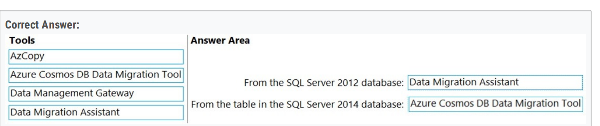

13、upload the data to Azure SQL Database every month

== D. Azure Data Factory

14、排除v1排除v2的cool

== A. Create an Azure Blob Storage account................

D. Create a general-purpose v2 storage account that is configured for the **Hot** default access。。。。。。。

15、 

Support server-side transactions across DB1 and DB

== B. two databases on the same Azure SQL managed instance

16、

the database must remain available in the event of a zone outage

== B. Azure SQL Database Premium

17、

Storage account type: **General purpose v2 with Hot access tier for blobs**

Confirguation to prevent modifications and deletions: **Container access policy**

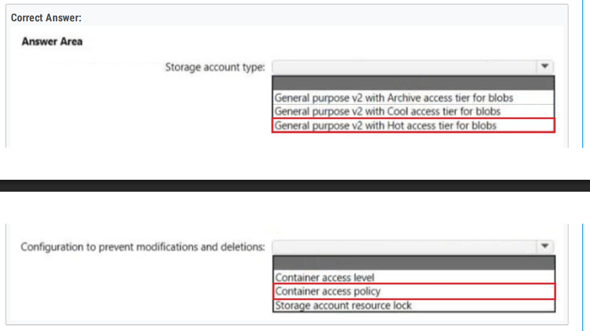

#### 18、

Data store for the ingested data: **Azure Data Lake Storage Gen2**

Data store for the data warehouse: **Azure SQL Database Hyperscale**

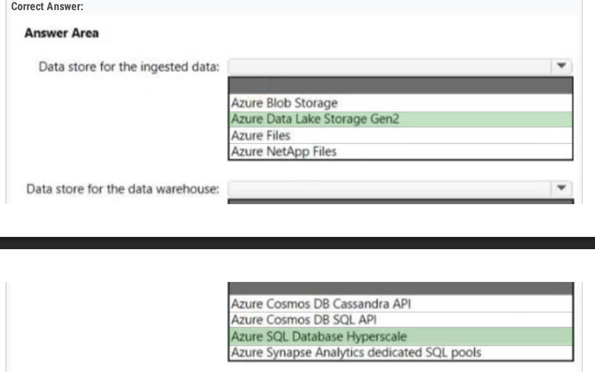

19、TDE 

== A. RSA 3072

20、same to 9

== C. Azure Cosmos DB for NoSQL

D. Azure Time Series Insights

21、000

#### 22、

Ingest data from Data Lake Storage into hash-distributed tables: **A dedicated SQL pool: A dedicated SQL pool**

Implement query, and update data in Delta Lake: **A serverless Apache Spark pool**

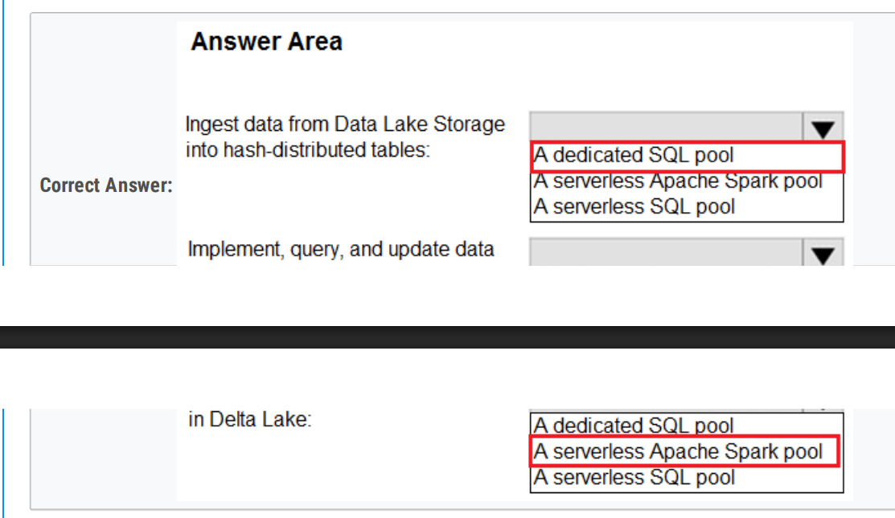

23、**HDFS**

== A. Azure Data Lake Storage Gen2

#### 24、

Image storage: Azure Blob storage

Customer account: Azure Cosmos DB

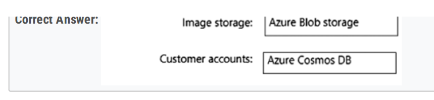

25、000

26、mysql

== B. General Purpose

27、**Support SQL queries**. • Support geo-replication. • Store and access data relationally

== B. PostgreSQL

28、

**Avro =  Data Lake**

Storage type: Azure Data Lake Storage Gen2

Data type: Avro

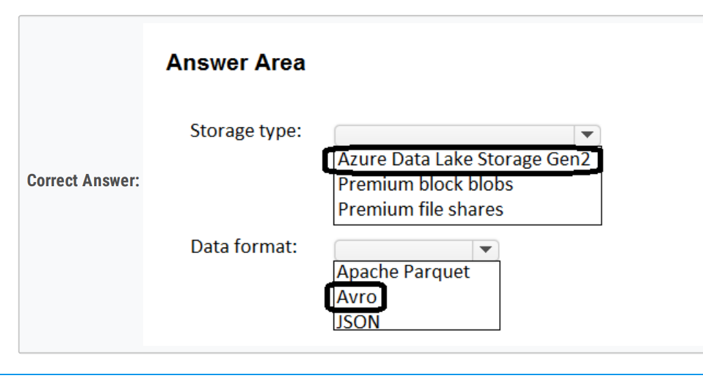

29、000

30、Dynamic data masking == Always Encrypted

phone number: **Dynamic data masking**

social security numbers: **Always Encrypted**

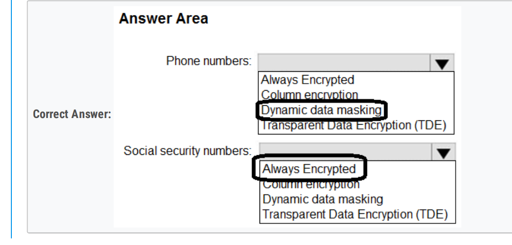

31、**Disables anonymous access** to the storage account • Supports access control list (**ACL**)-based Azure AD permissions 

== B. Azure Data Lake Storage

32、

For storage and interactive analytics: **Azure Data Explorer**

Query language: KQL

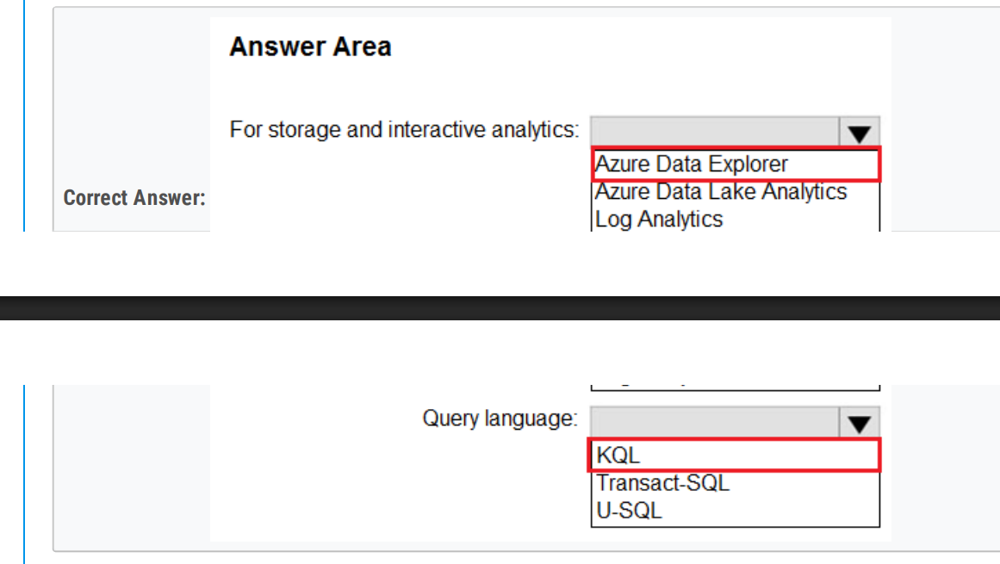

#### 33、Azure SQL product = A single Azure SQL database + GP

Azure SQL product: **A single Azure SQL database**

Service tier: **General Purpose**

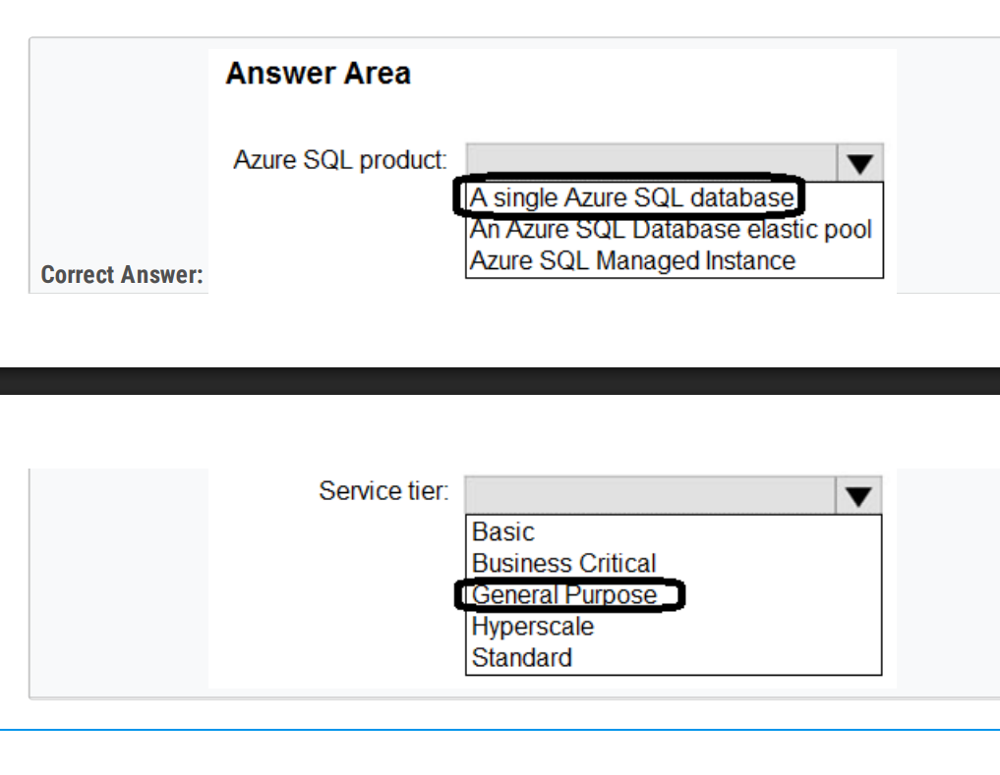

#### 34、

Blob type: Block

Enable: The change feed

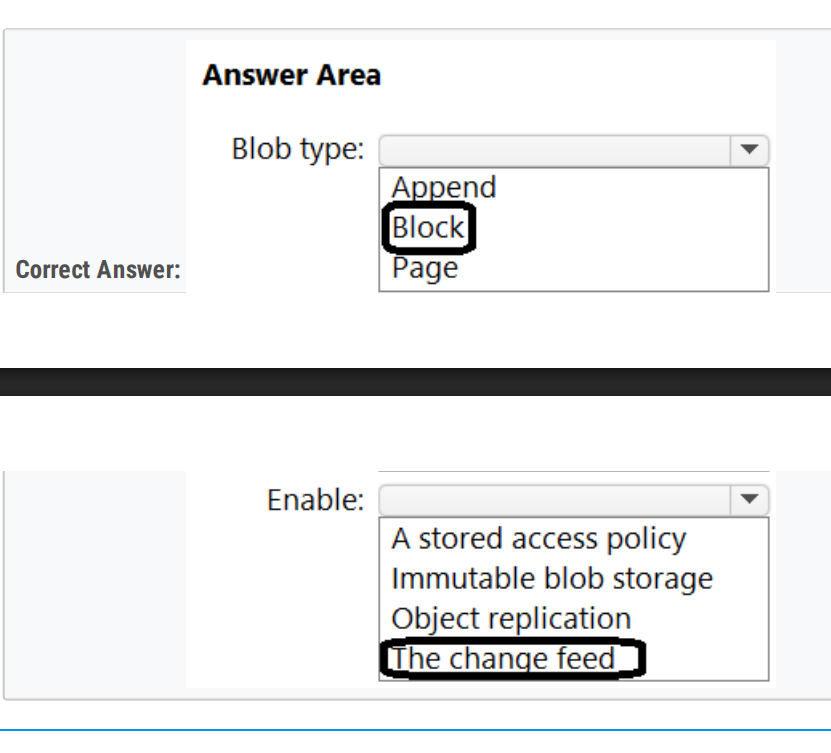

#### 35、Azure Synapse pipeline == Azure Data Share

Upload and transform the data: **Azure Synapse pipeline**

Provide restricted access: **Azure Data Share**

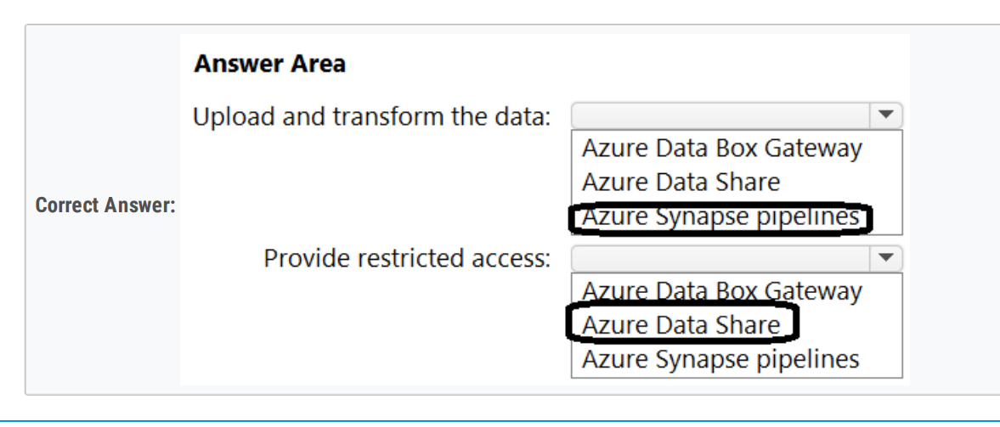

#### 36、synapse == azure analysis services

To implement the data warehouse: **An Azure Synapse Analytics dedicated SQL pool**

To implement the serving layer: **Azure Analysis Services**

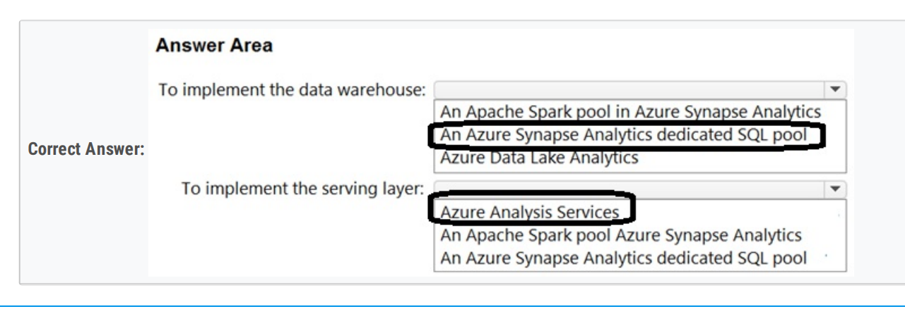

#### 37、Service = A single Azure SQL database + Hyperscale

Service: **A single Azure SQL database**

Service tier: **Hyperscale**

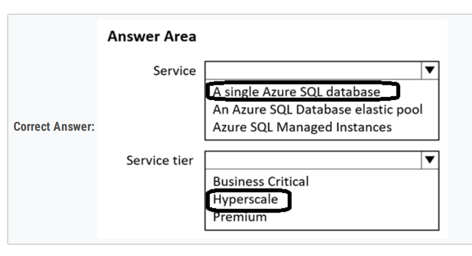

38、restore the last uploaded version of File1.txt from any day for up to 30 days

== D. blob versioning

39、ETL

== A. Azure Data Factory

