# AZ305 复习 topic 3

Solution: You deploy two Azure virtual machines to two Azure regions, and you create an **Azure Traffic Manager profile**. == Yes

Storage account type*

Gateway Load Balancer > front door

## 1-27

### HARD: 1，7，9，12，17，18，21，23，24

1、 RTO RPO

== D. Azure Site Recovery

2、

Virtual Machines that are backed up by using the policy can be recovered for up to a maximum of: **36 months**

The minimum recovery point objective (RPO) for virtual machines that are backed up by using the policy is: **1 day**

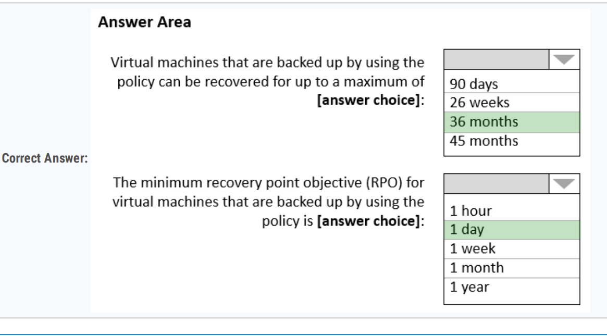

3、 Provide access to the full .NET framework

Solution: You deploy two Azure virtual machines to two Azure regions, and you create an **Azure Traffic Manager profile**.

== Yes

4、. Solution: You deploy two Azure virtual machines to two Azure regions, and you deploy an Azure Application Gate

no

5、

Storage tier: **Premium**

Redundancy: **ZRS**

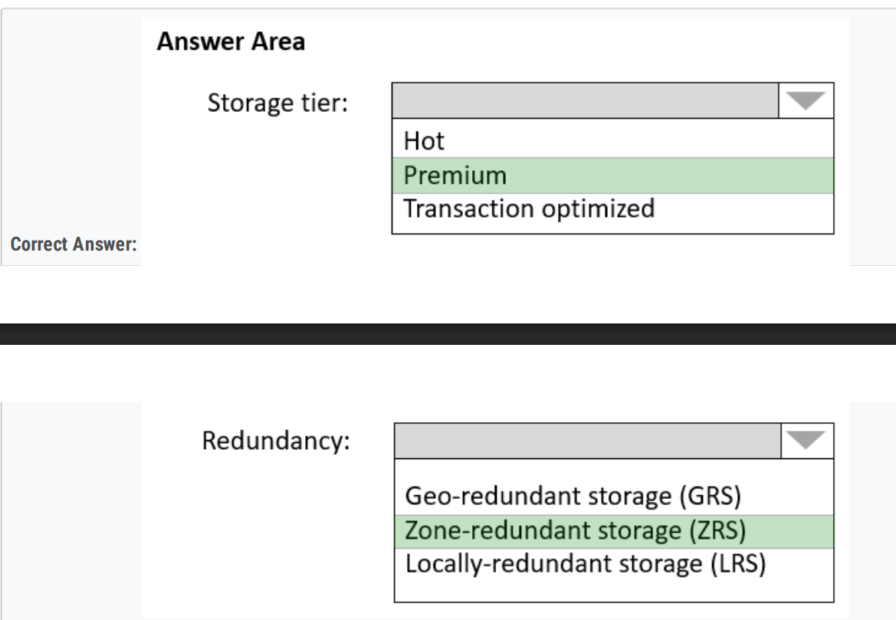

6、000

#### 7、

Application1:  **BlobStorage with Premium Performance and ZRS replication**

Application2:  **General purpose v2 with Standard Performance, Cool access tier, and RA-GRS replication**

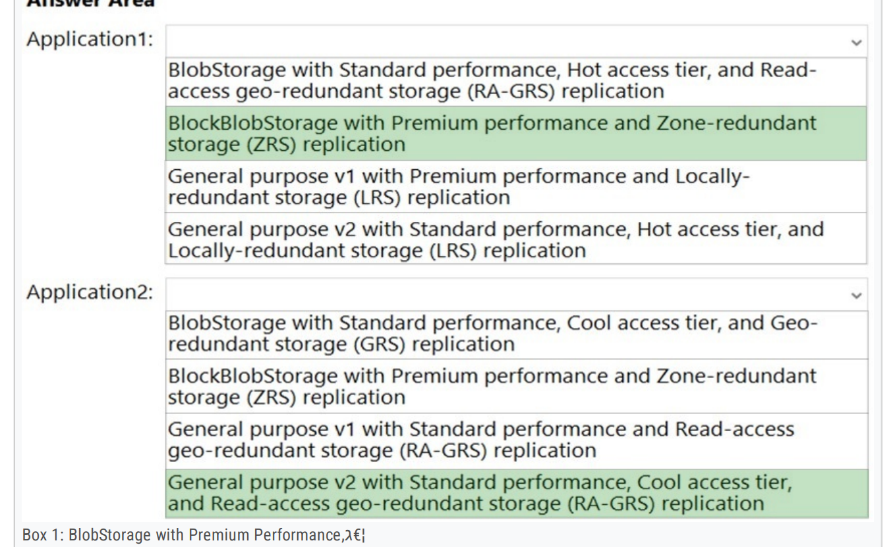

8、

Prevent new data from being modified for **one year.**  

Maximize data resiliency.  

Minimize read latency. 

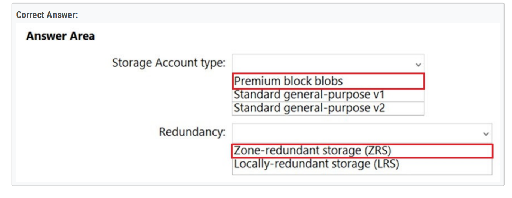

9、有AKS

connection traffic over the internet is encrypted by using SSL

== A. Azure Front Door

10、

**Be available if a single Azure datacenter fails**.  

Support storage tiers.  

Minimize cost. 

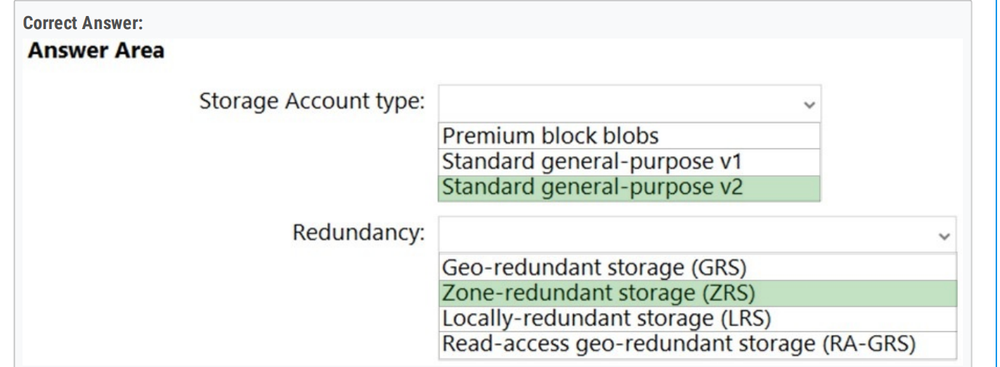

11、

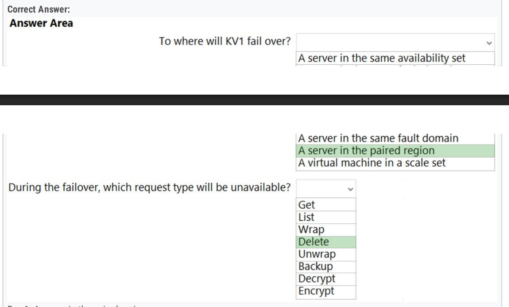

12、

Sales: **Azure Site Recovery only**

Finance: **Azure Site Recovery and Azure Backup**

Reporting: **Azure Backup only**

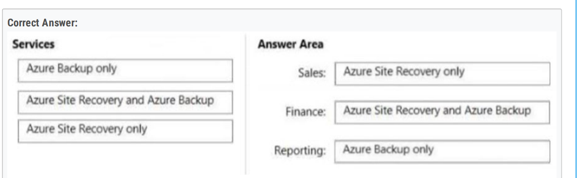

13、000

14、000

15、000

16、如果没有premium，就是Business Critical，有争议

== B. Azure SQL Database Business Critical

#### 17、

Azure servie or service tier: **The hyperscale service tier**

Replication mechanism: **Active geo-replication**

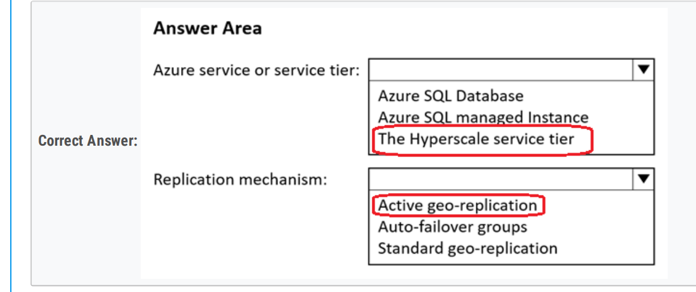

18、

Prepare for the migration by: **Creating an Always On availablility group on VM1**

Perform the migration by using: **Azure migration**

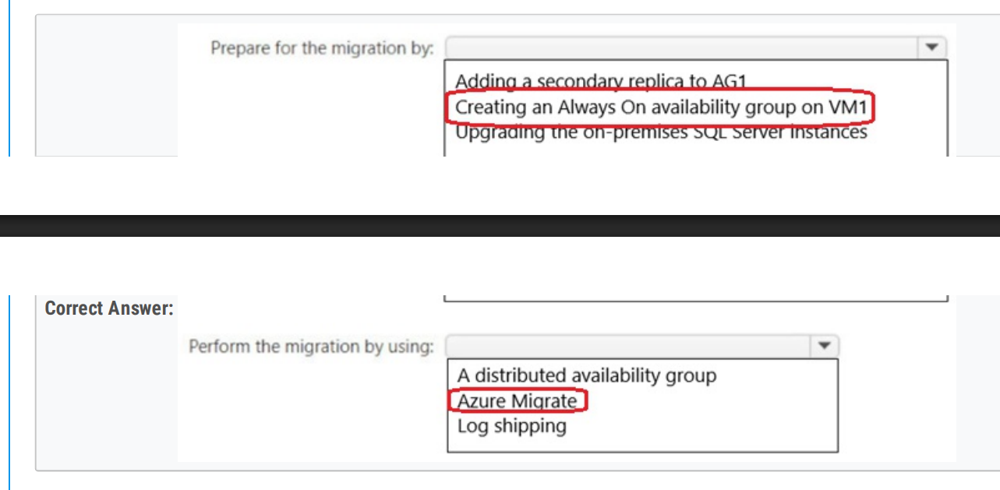

19、

Service tier and computer tier: **General Purpose service tier and Serverless computer tier**

Encryption method: **Always Encrypted**

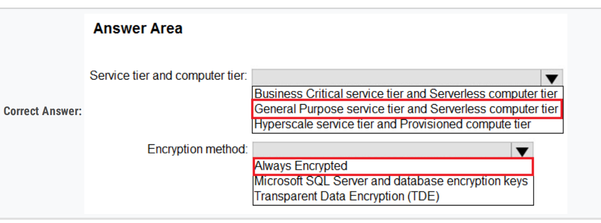

20、minimize downtime in the event of a failover to a paired region.

== C. Implement Geo-redundant backup

#### 21、 

incoming traffic for VMSS1 across NVA1 and NVA2

== A. Gateway Load Balancer

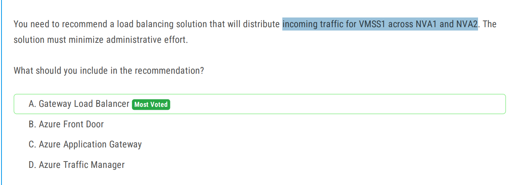

22、Recovery Services vault = Resource Guard

Sub1: **A Recovery Services vault**

Sub2: **A Resource Guard**

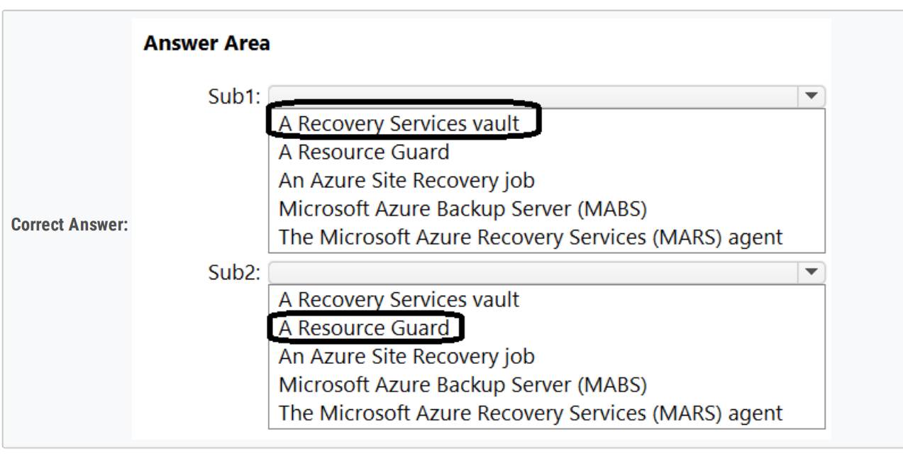

#### 23、MARS = LRS

On the servers: **The Microsoft Azure Recovery Services (MARS) agent**

For the storage: **LRS**

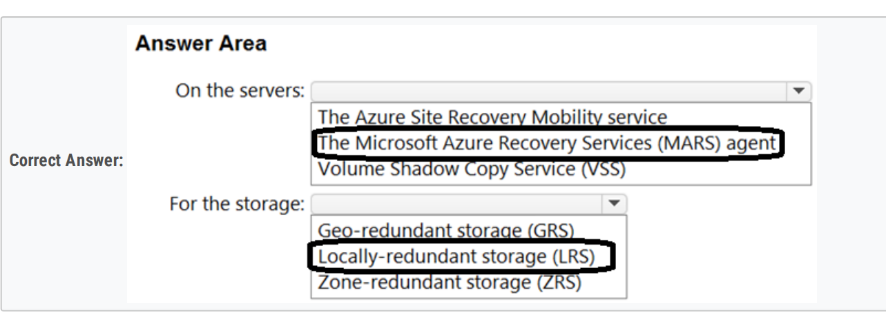

#### 24、

For global load balancing: **Azure Front door**

As the ingress controller: **Azure Application Gateway**

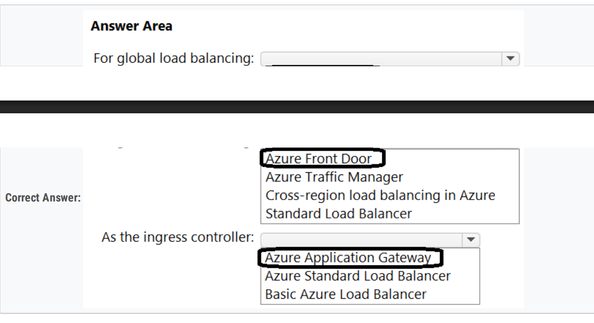

25、

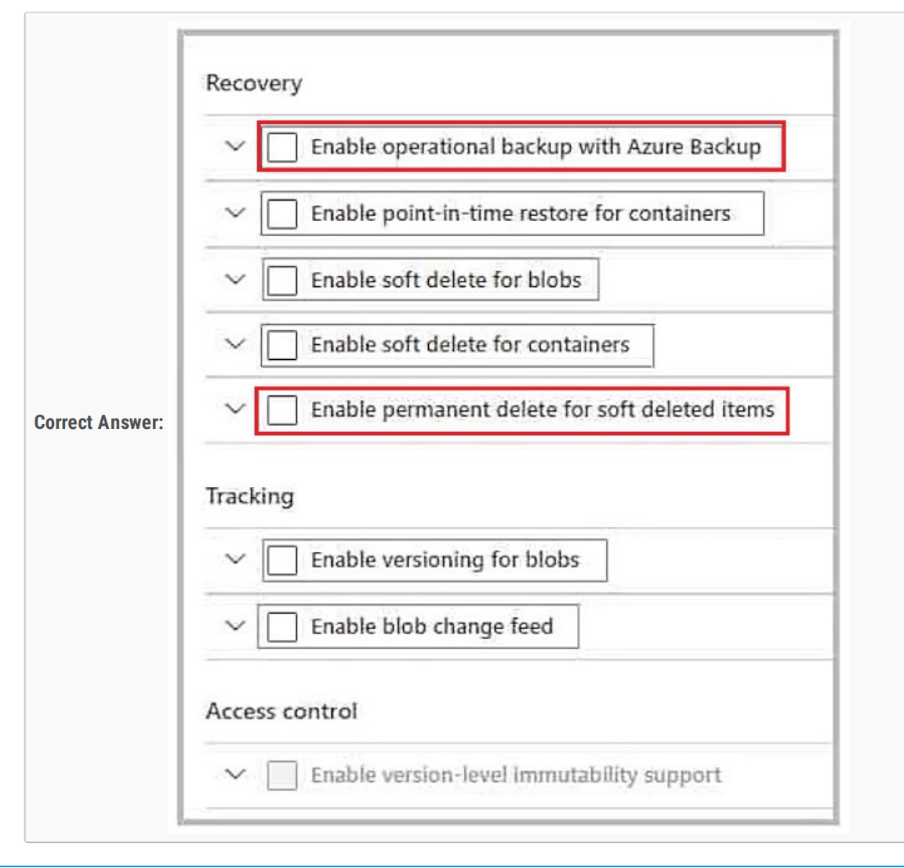

26、

To run the containerized apps:                                                              Azure Container Apps

FOr the lifecycle management and storage of container images:  Azure Container Registery

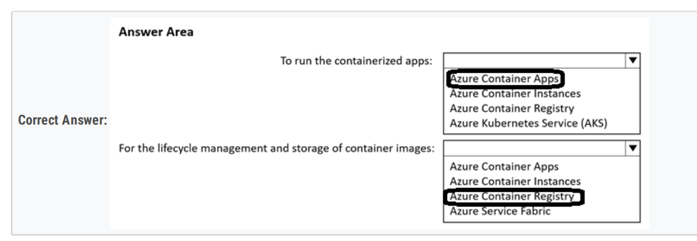

27、GRS

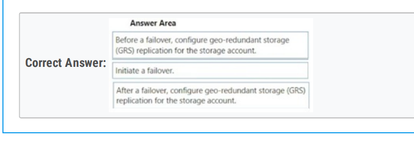

