# AZ305 复习 topic 4

Premium > business cri

DMS > Azure Migrate

bus > storage queue

57和109的区别

Solution: You use **Azure Front Door** to provide access to the app == yes

Solution: You recommend using an **Azure Policy initiative to enforce the location.** == yes

Solution: You recommend using an Azure Policy initiative to enforce the location **of resource groups**. == NO

## 1-30

### HARD: 1，6，16，21，27，26/28，29

#### 1、

create an ExpressRoute association to VirtualWAN1.

== A. **Upgrade** VirtualWAN1 to Standard

#### 2、

== B. Azure Logic Apps and Azure Function

3、LDAP

== **D. Azure AD Domain Services (Azure AD DS)**

#### 4、

access the private IP address of a Microsoft SQL Server instance

== B. Azure Functions in the Premium plan

#### 5、

access the shared files as quickly as possible if the Toronto branch office is inaccessible.

== D. an Azure file share and Azure File Sync

6、

onpremise = onpremise gateway

connection gateway resource

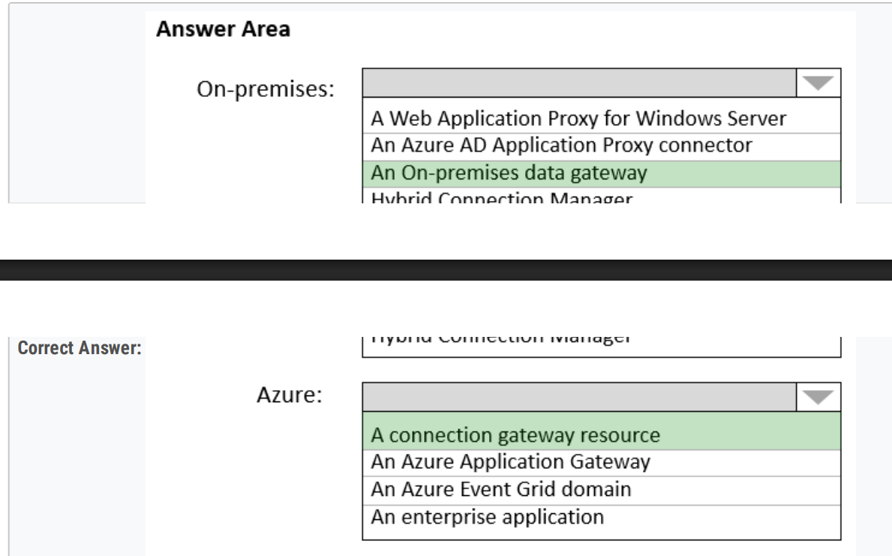

#### 7、

APIM YYN

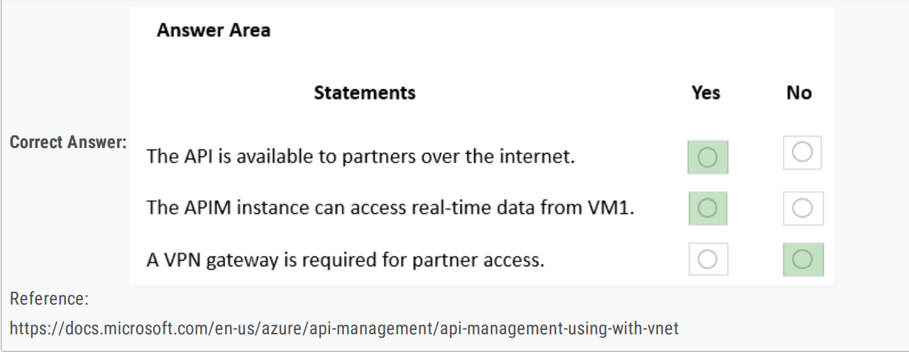

#### 8、

APP GATEWAY

WAF

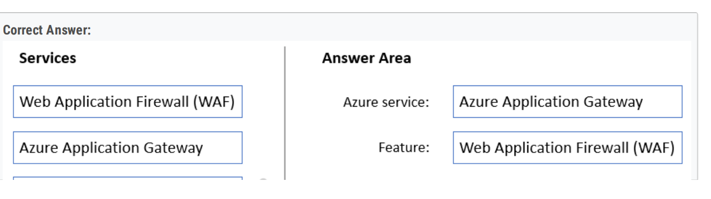

9、 

microservices must be restricted to a single private IP address and protected by using mutual TLS authentication.

== D. Azure API Management Premium tier with virtual network connection

#### 10、 

Minimize maintenance overhead

== A. an Azure App Service web app

#### 11、

What is the minimum number of additional Azure Firewall policies you should create?

3

12、rewriting App1 as an Azure web app and plans to migrate all the data to Azure.

== A. vCore-based General Purpose

13、XML message

== C. Azure Service Bus

14、move all the virtual machines to Azure.

== C. Azure Migrate

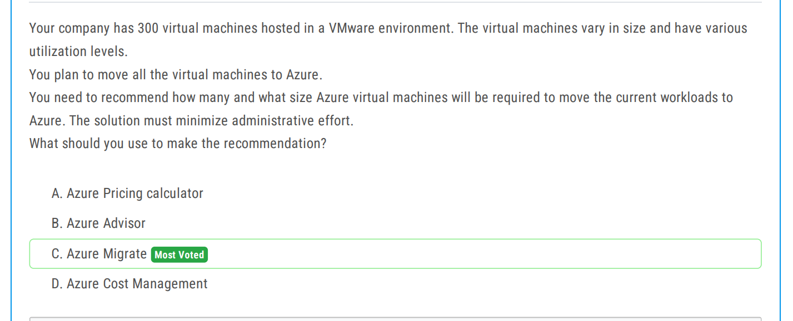

15、HPC

== B. Azure CycleCloud

#### 16、

**TM PROFILE**

**priority traffic routing**

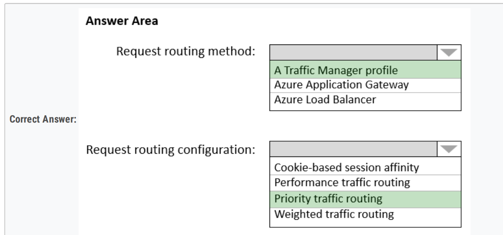

17、deploy multiple instances of an Azure web app across several Azure regions.

Solution: You use **Azure Traffic Manager** to provide access to the app

No

18、

Solution: You use **Azure Load Balancer** to provide access to the app

no

19、

Solution: You use **Azure Application Gateway** to provide access to the app

no

20、BGP

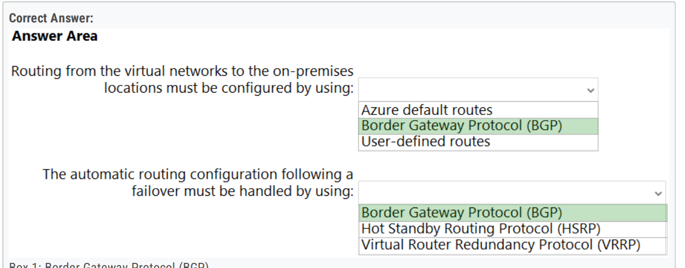

21、

v2

grs

pe

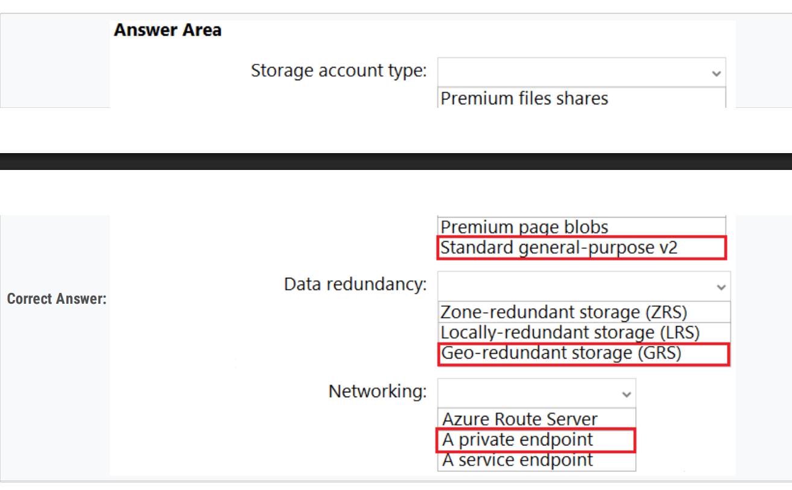

22、

get only

anonymous

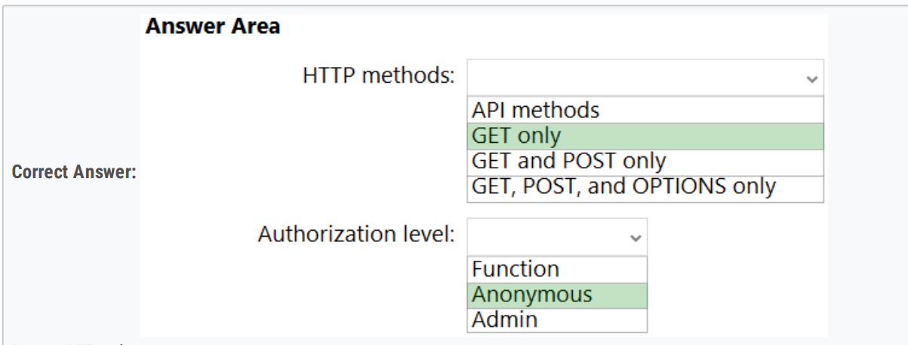

23、Only allow the creation of specific sizes of virtual machine

== B. Azure Policy

24、

24/27

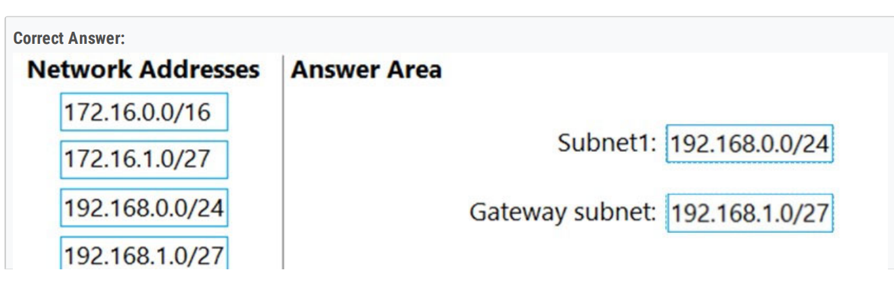

25、transform the data by using mapping data flow

C. Azure Data Factory 

26、 Support autoscaling of Windows Server containers

C. cluster autoscaler

27、

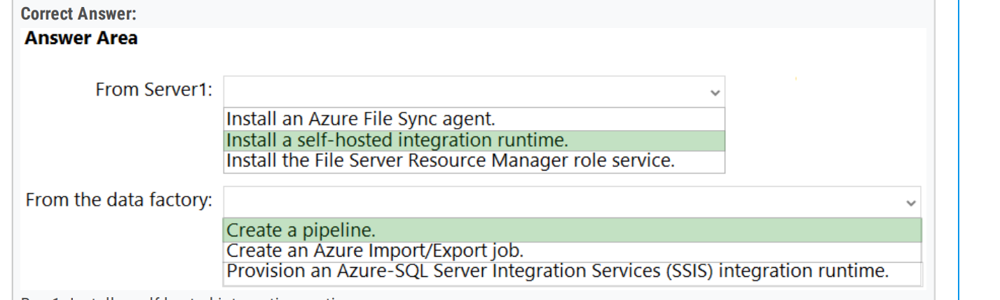

28、Support autoscaling of Linux containers

C. virtual nodes

#### 29、

B. an Azure Data Factory pipeline

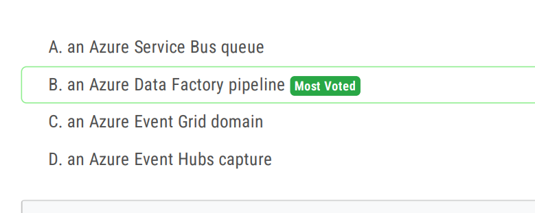

30、SSIS

B. Azure Data Factory

## 31-60

### HARD: 36,45,49,50,51

#### 31、

use Azure Data Factory to transform the data files, and then load the files to Azure Data Lake Storage.

C. the self-hosted integration runtime

32、sso mfa

C. Azure AD enterprise applications

E. Conditional Access policies

33、a difference between using Azure Blueprints and Azure Resource Manager (ARM) templates?

D. Blueprints remain connected to the deployed resources.

34、

vm1

vm2

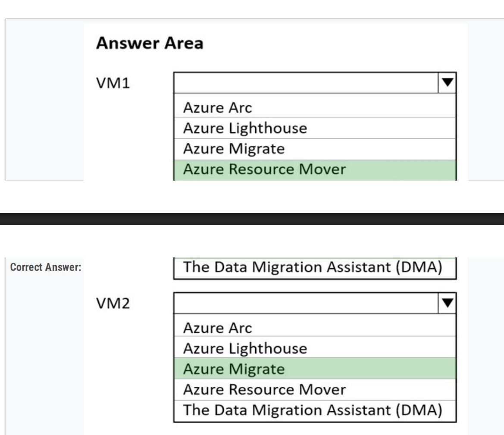

35、

WAF

A. Azure Front door

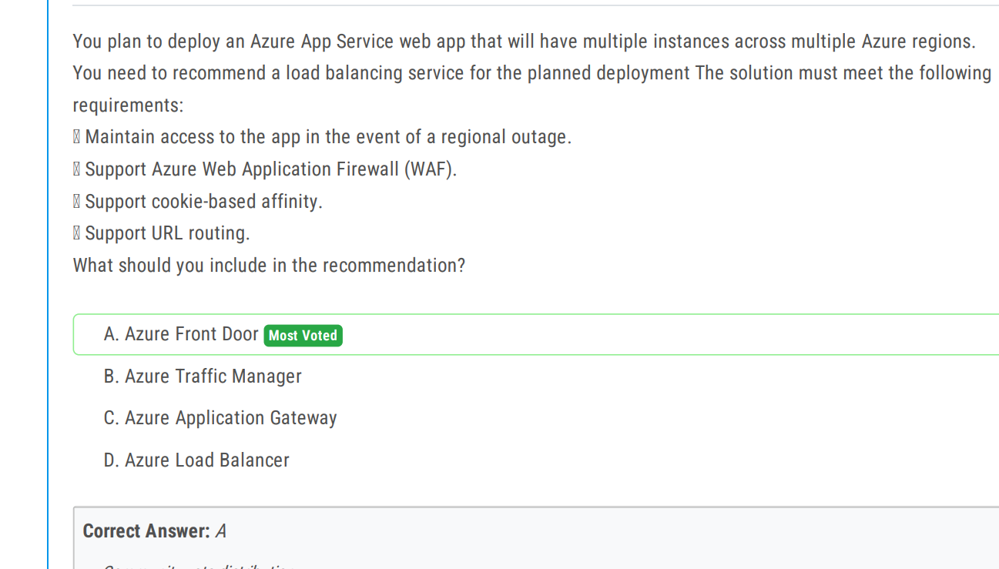

36、

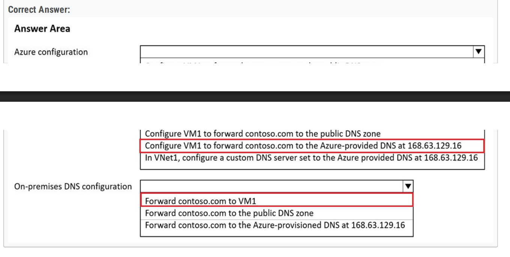

#### 37、

automatic repairs

C. Azure Service Fabric

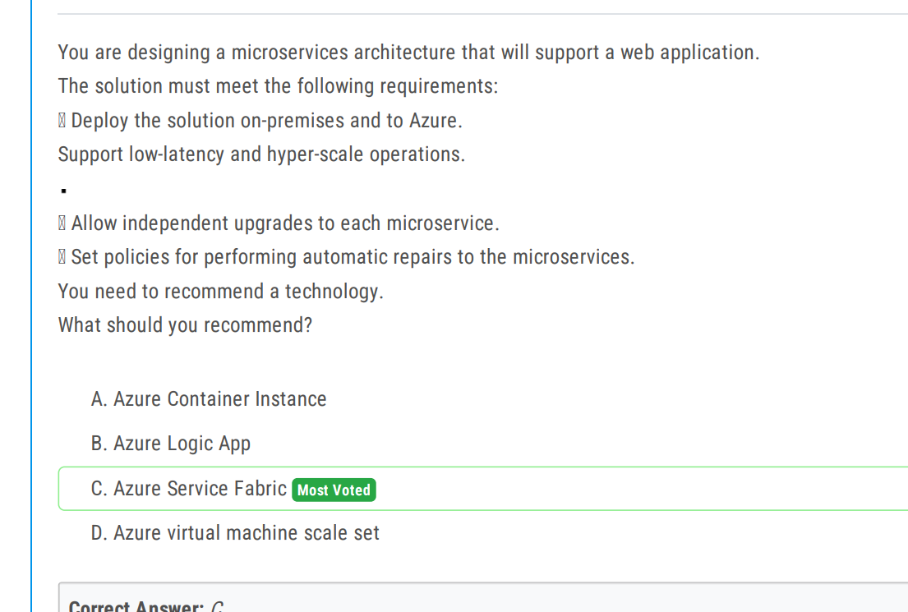

38、 Ensure that users can access the app in the event of a regional outage

Solution: You use **Azure Front Door** to provide access to the app

Yes

39、000

40、000

41、000

42、000

#### 43、

SLA for the latency of write operations and the throughput.

D. Azure Cosmos DB

#### 44、 

Support at least 500 requests per second. Support a large image, video, and audio streams.

B. premium block blobs

#### 45、 

Ensures that applications can access the data by using a REST connection Hosts 20 independent tables of varying sizes and usage patterns Automatically replicates the data to a second Azure region Minimizes costs

B. tables in an Azure Storage account that use geo-redundant storage (GRS)

46、000

47、

root

subscription

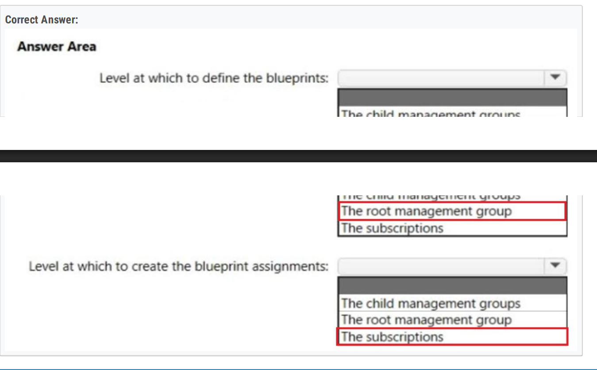

48、

none

readonly

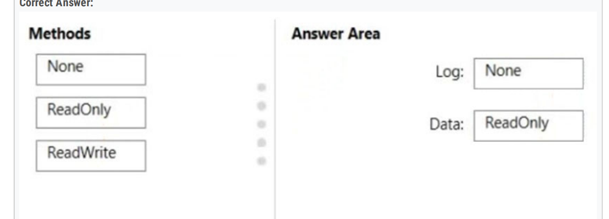

#### 49、3D geometry

D. Create a render farm that uses Azure Batch

E. Enable parallel task execution on compute nodes

#### 50、

You need to migrate the application data to Azure

B. SQL Server on an Azure virtual machine

D. Azure SQL Managed Instance

#### 51、

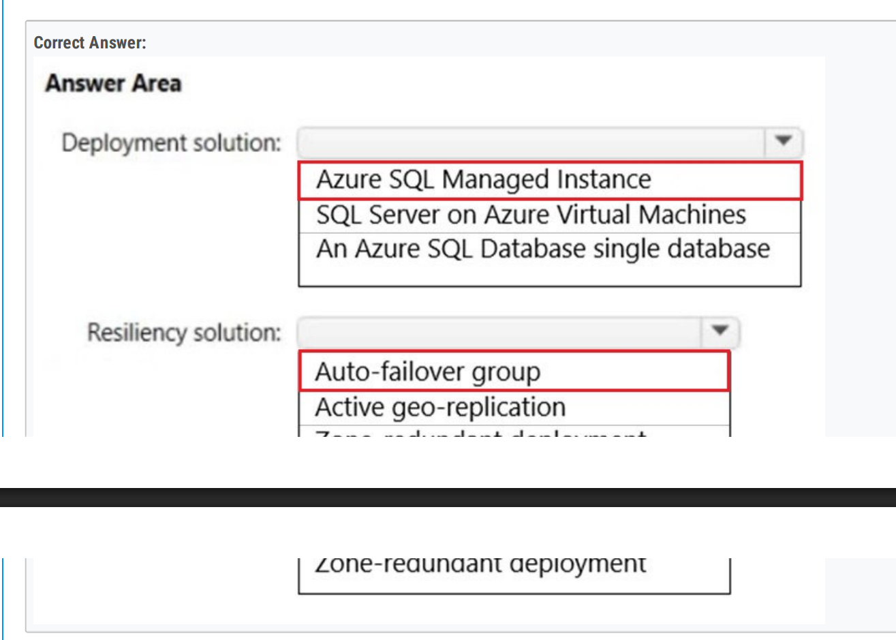

52、 Failover between replicas of the database must occur without any data loss. The database must remain available in the event of a zone outage

D. Azure SQL Database Serverless

53、

D. the same geography only

#### 54、

DNN

C. an Always On availability group that has premium storage disks and a distributed network name (DNN) 

55、Solution: You recommend creating resource groups based on locations and implementing resource locks on the resource groups.

no

56、Solution: You recommend using the Regulatory compliance dashboard in Microsoft Defender for Cloud.

no

57、Solution: You recommend using an **Azure Policy initiative to enforce the location.**

yes

58、 App1 must be available to users if an Azure datacenter becomes unavailable.

C. Deploy a load balancer and a virtual machine scale set across two availability zone。

59、updated container images are replicated automatically

B. Premium SKU Azure Container Registry

60、IAM

D. a resource token and an Access control (IAM) role assignment

## 61-90

### HARD: 61, 64，86，87

#### 61、

The storage must support access control lists (ACLs)

B. a general purpose v2 storage account that has hierarchical namespace enabled

62、

Purchase model: **vCore**

Deployment option: **An Azure SQL database elastic pool**

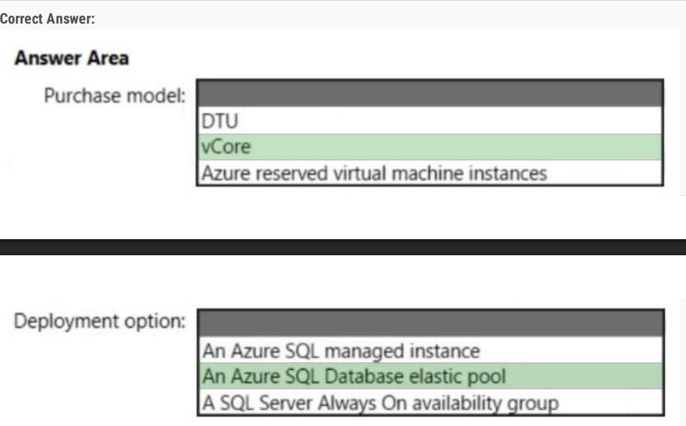

63、use Azure Databricks to transform and load data from App1 to an Azure Synapse Analytics instance.. 

C. Azure Data Lake Storage

E. Azure Data Factory

#### 64、low-priority == batch

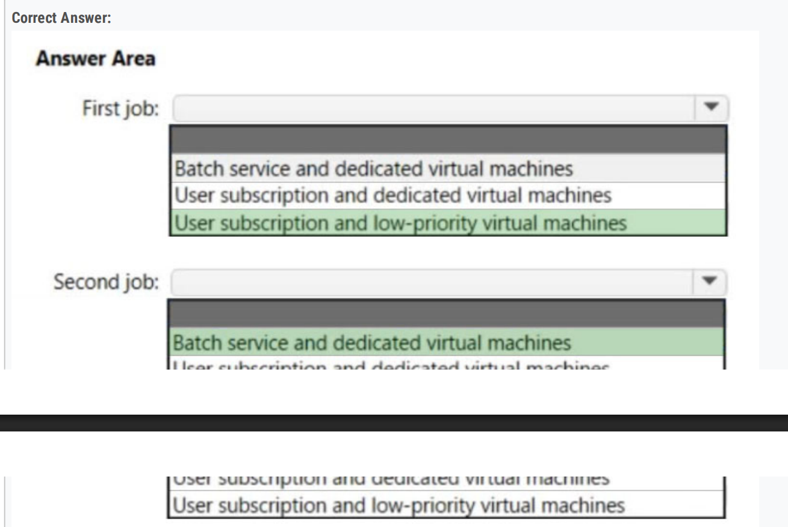

65、using XML messages 如果没有service bus，就选这个

C. Azure Queue Storage

66、000

67、000

68、000

69、000

70、000

71、000

72、 network traffic between virtual networks must be filtered by using FQDNs

A. Azure Virtual **WAN** with a secured virtual hub

73、000

#### 74、

只有3个选项

B. a service principal

75、

2个owner

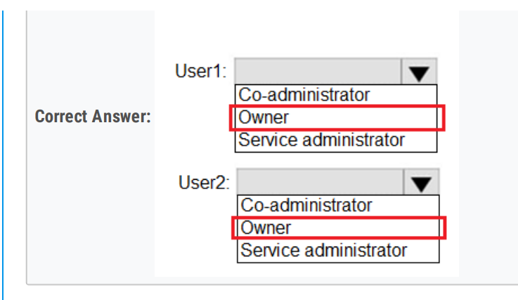

76、000

77、

read data有delay用redis

The backend service of App1 writes data to SQL1. Users use the App1 client to read the data from SQL1. During periods of high utilization, the users experience delays retrieving the data. You need to minimize how long it takes for data requests.

A. Azure Cache for Redis

78、 if VM3 fails, requests will be routed automatically to VM2

D. Azure Front Door Premium

79、FIFO

C. Azure Service **Bus** queues with **sessions** enabled

80、

DS

Premium SSD

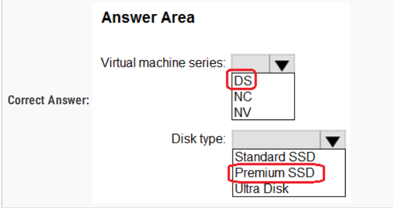

81、• Supports estimates of request processing runtimes • Supports event-driven autoscaling for the app

D. Premium

82、000

83、000

84、000

85、000

#### 86、

WAN hubs 3

SKU Standard

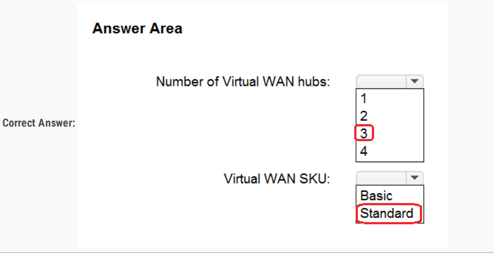

#### 87、KEDA == horizontal pod autoscaler

A. Configure the horizontal pod autoscaler. 

E. Install Kubernetes-based Event Driven Autoscaling (KEDA).

88、000

89、000

90、000

## 91-120

### hard：93,104

91、000

92、000

93、 

on-premises **Microsoft SQL Server 2008** instance that hosts a 50-GB database

B. Azure Data Studio 

94、000

95、000

96、000

97、000

98、000

99、Azure SQL Database Serverless

100、000

101、000

102、

2B

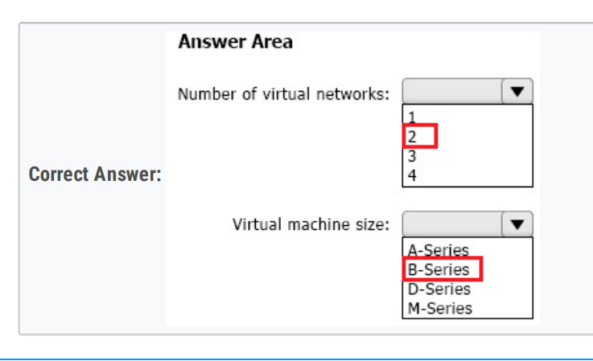

103、000

#### 104、

B. Azure Database Migration Service （DMS）

105、000

106、000

107、000

#### 108、

OWASP

JWTs

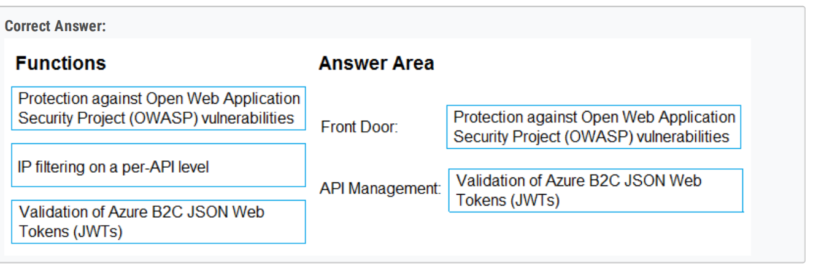

#### 109、

Solution: You recommend using an Azure Policy initiative to enforce the location **of resource groups**.

NO

#### 110、

The number of instances must be managed automatically depending on the load.

B. Azure App Service

#### 111、

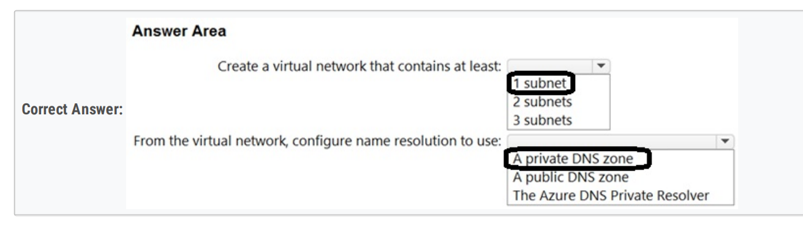

#### 112、

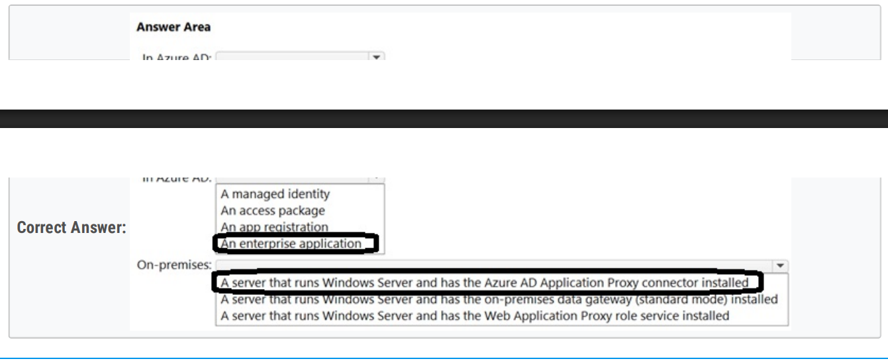

113、

D. Deploy an **ingress controller** to AKS1.

#### 114、

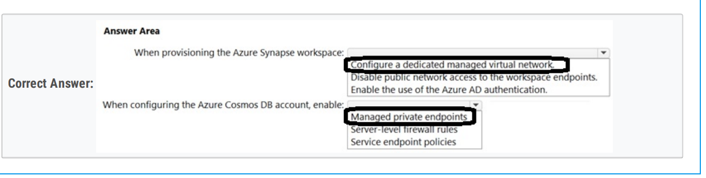

115、NRT

A. Apache Spark

116、

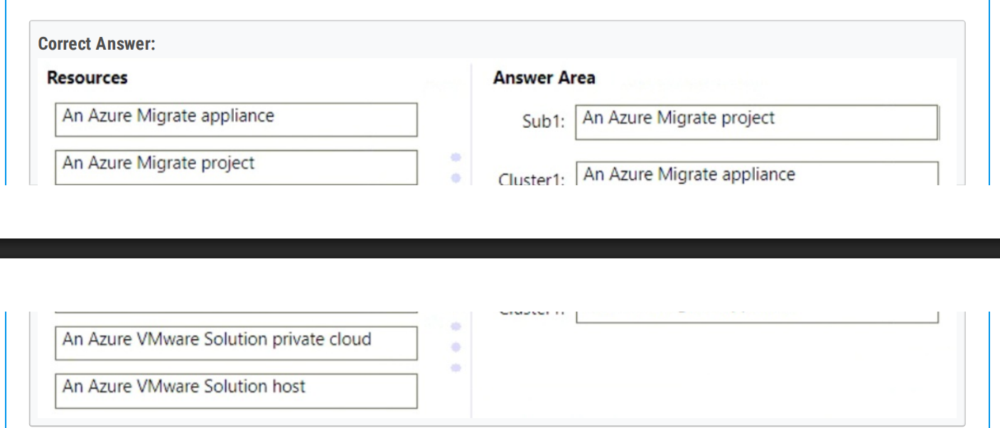

#### 117、

118、000

119、000

120、000

## 121-127

121、000

122、000

123、000

#### 124、

AMPLS 1

2

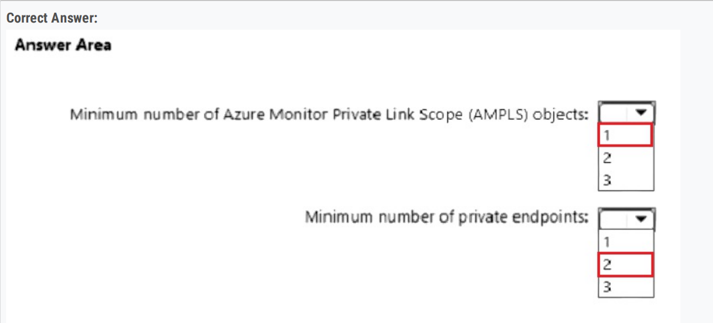

125、000

#### 126、

**ABAC**

assign permissions to **blobs**

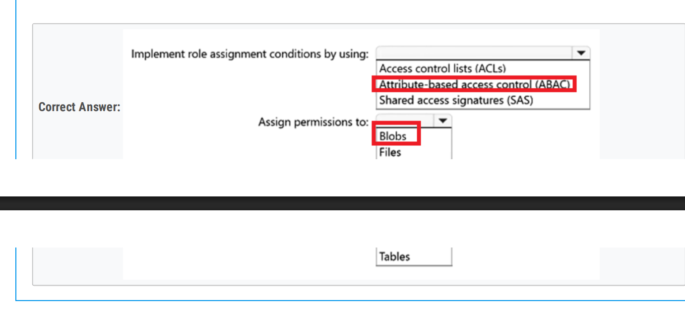

127、000

