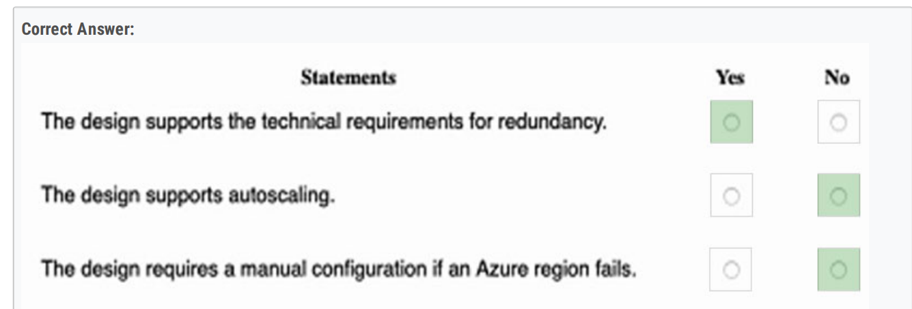
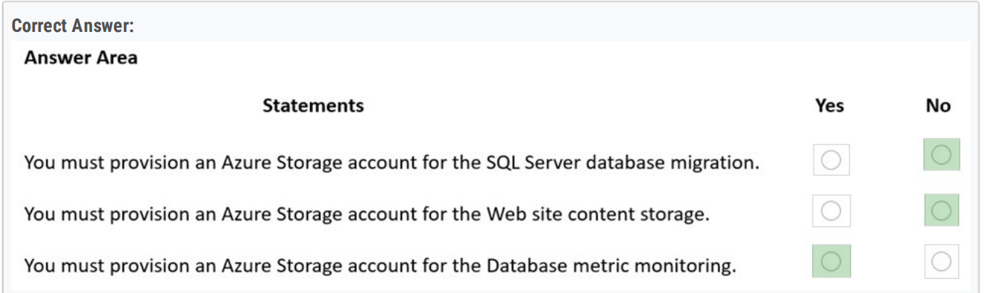
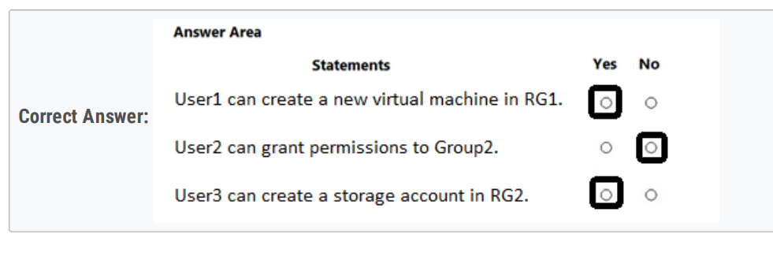
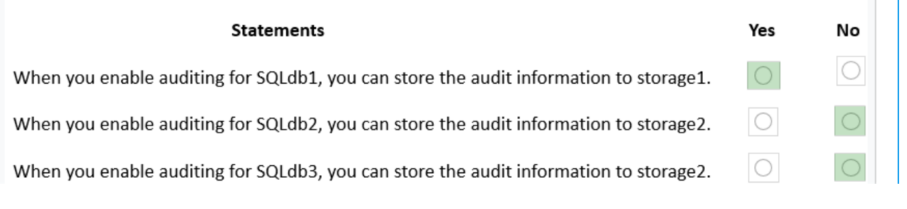
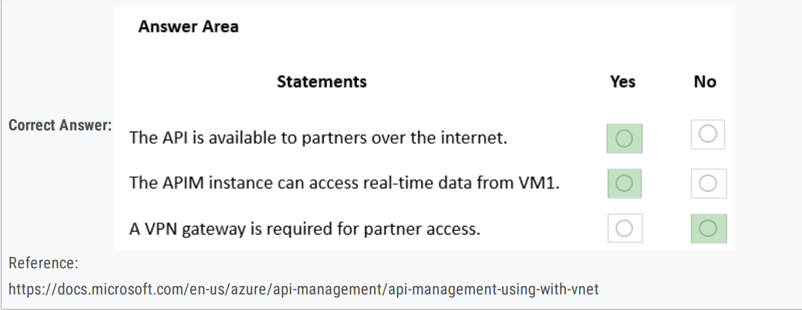
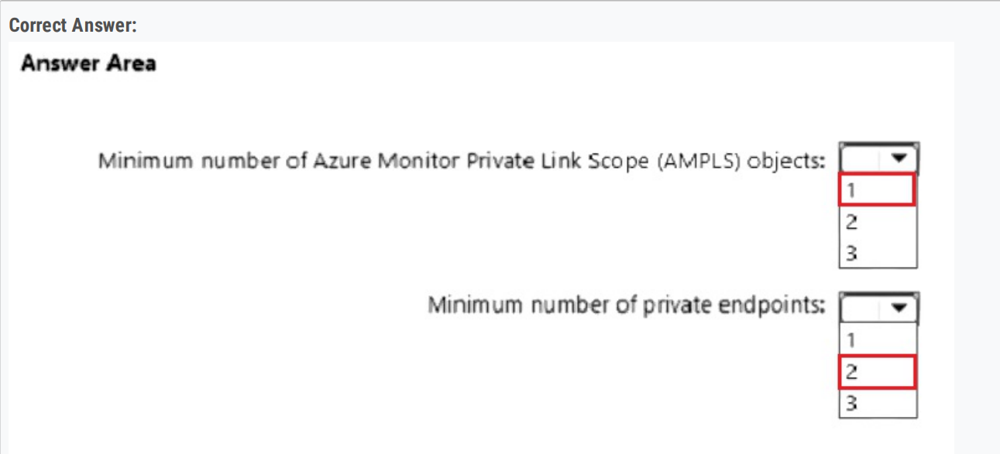

### t2-33

Azure SQL product: **A single Azure SQL database**

Service tier: **General Purpose**

### t2-37

Service: **A single Azure SQL database**

Service tier: **Hyperscale**

t2-8 OLTP = SQL DB

Service: Azure SQL Database

Service tier: Hyperscale

case study 里的都是BC TIER

============================

### t3-21

incoming traffic for VMSS1 across NVA1 and NVA2

== A. Gateway Load Balancer

不选front door

t3-9、有AKS的要选front door

connection traffic over the internet is encrypted by using SSL

== A. Azure Front Door

t4-35

URL Routing选front door

t4-78 3个vm。3个vnet

要选D. Azure Front Door Premium

============================

t4-10、 Minimize maintenance overhead

== A. an Azure App Service web app

不选function

t4-110 要选B. Azure App Service

The number of instances must be managed automatically depending on the load.

B. Azure App Service

===============

单选题里的数量：

t4-11

firewall policy = 3

t1

minimum number of Azure Monitor workspaces = 1

后面case study

RBAC Assignment = 2

============

t4-43 有SLA要选Azure Cosmos DB，不能选datalake

SLA for the latency of write operations and the throughput.

D. Azure Cosmos DB

ACL, 选datalake

t4-44 Support at least 500 requests per second. Support a large image, video, and audio streams.

要选premium block blobs，不能选 standard general-purpose v2

============

t2-2 store a copy of the company files from Server1 in store1

== B. an Azure Import/Export job

C. Azure Data Factory

t4-63、use Azure Databricks to transform and load data from App1 to an Azure Synapse Analytics instance.. 

C. Azure Data Lake Storage

E. Azure Data Factory

============

T1 

T2

T4

