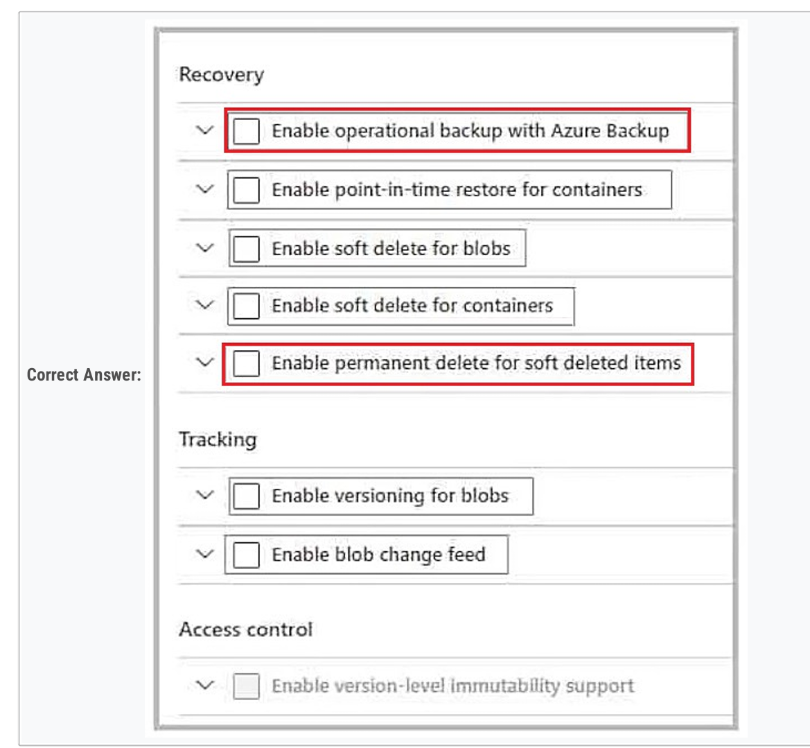

# AZ305 Class

## AAD

### topic 1

1、AAD

verify whether the Fabrikam developers sti l require permissions to Application1. The solution must meet the fo lowing requirements:  

To the manager of the developers, send a **monthly email message** that lists the access permissions to Application1. 

If the manager does not verify an access permission, automaticaly **revoke that permission**.  

**Minimize development effort.** 

 In Azure Active Directory (Azure AD), create an access review of Application1.

4、AAD

You have an Azure Active Directory (Azure AD) tenant named contoso.com that has a security group named Group1. 

Group1 is configured for assigned membership. Group1 has 50 members, including 20 guest users.  

You need to recommend a solution for evaluating the membership of Group1:

- The **evaluation** must be repeated automaticaly every three months.  

- Every member must be able to **report** whether they need to be in Group1.  

- Users who report that they do not need to be in Group1 must be **removed** from Group1 automaticaly.  

- Users who do not report whether they need to be in Group1 must be **removed** from Group1 automaticaly. 

Create an access review.

6、webapp/AAD

App1 will be accessed from the internet by the users at your company. All the users have computers that run Windows 10 and are joined to Azure AD.  You need to recommend a solution to ensure that the users can connect to App1 **without being prompted for authentication** and can access App1 only from **company-owned computers**. 

The users can connect to App1 without being prompted for authentication: An Azure AD app registration

The users can access to app1 only from company-owned computers: A conditional Access policy

12、AAD

Your on-premises network contains a server named Server1 that runs an ASP.NET application named **App1**.  You have a hybrid deployment of Azure Active Directory (Azure AD). 

You need to recommend a solution to ensure that users sign in by using their Azure AD account and Azure Multi-Factor Authentication (MFA) when they connect to App1 from the internet.  

Which three features should you recommend be deployed and configured in sequence? 

Azure AD Application Proxy

an Azure AD enterprise application

a conditional Access policy

18、AAD

You have several Azure App Service web apps that use Azure Key Vault to store data encryption keys.  

Several departments have the following requests to support the web app: 

Security: Azure AD Privileged Identity Management (PIM)

Deployment: Azure Managed Identity (MI)

Quality Assurance: Azure AD Privileged Identity Management (PIM)

## Storage

### topic 1

2、Storage

Ten users in the finance department of your company plan to access the blobs during the month of April.  You need to recommend a solution to enable access to the blobs during the month of April only. 

 shared access signatures (SAS) 

### topic 2

### Topic 3

T3-5、storage

You plan to create an Azure Storage account that wi l host file shares. The shares wi l be accessed from on-premises applications that are transaction intensive.  You need to recommend a solution to minimize latency when accessing the file shares. The solution must provide the highest level of resiliency for the selected storage tier. 

Storage tier: Premium

Redundancy: ZRS

T3-7、storage

You need to recommend an Azure Storage account configuration for two applications named Application1 and Application2. The configuration must meet the fo lowing requirements:  

Storage for Application1 must provide the highest possible transaction rates and the lowest possible latency.  

Storage for Application2 must provide the lowest possible storage costs per GB.  

Storage for both applications must be available in an event of datacenter failure.  

Storage for both applications must be optimized for uploads and downloads. 

Application1:  BlobStorage with Premium Performance and ZRS replication

Application2:  General purpose v2 with Standard Performance, Cool access tier, and RA-GRS replication

8、storage

You plan to develop a new app that will store business critical data. The app must meet the following requirements:  Prevent new data from being modified for one year.  

Maximize data resiliency.  

Minimize read latency. 

Storage Account type: Premium block blobs

Redundancy: ZRS

10、storage

You have an on-premises file server that stores 2 TB of data files.  You plan to move the data files to Azure Blob Storage in the West Europe Azure region.  You need to recommend a storage account type to store the data files and a replication solution for the storage account. The solution must meet the following requirements:  

Be available if a single Azure datacenter fails.  

Support storage tiers.  

Minimize cost. 

Storage account type: Standard general-purpose v2

Redundancy: ZRS

27、storage

You plan to use Azure Storage to store data assets.  You need to identify the procedure to fail over a general-purpose v2 account as part of a disaster recovery plan. The solution must meet the following requirements:  

• Apps must be able to access the storage account after a failover.  

• You must be able to fail back the storage account to the original location.  

• Downtime must be minimized. 

Before a failover, configure geo-redundant

Initial a failover

After a failover, configure geo-redundant

## APP

### topic 1

3、Web app

You have an internal web app named WebApp1 that is hosted on-premises. WebApp1 uses Integrated Windows authentication.  Some users work remotely and do NOT have VPN access to the on-premises network.  You need to provide the remote users with **single sign-on (SSO) access** to WebApp1. 

Azure AD Application Proxy 

Azure AD enterprise applications

https://learn.microsoft.com/en-us/azure/active-directory/app-proxy/application-proxy 

https://learn.microsoft.com/en-us/azure/active-directory/manage-apps/add-application-portal 

### topic 2

### topic 3

15、APP

Provide access to the fu l .NET framework.  Provide redundancy if an Azure region fails.  Grant administrators access to the operating system to insta l custom application dependencies.

Solution: You deploy a web app in an Isolated App Service plan. 

No

19、APP

You are building an Azure web app that will store the Personally Identifiable Information (PII) of employees.  You need to recommend an Azure SQL. Database solution for the web app. The solution must meet the following requirements: 

• Maintain availability in the event of a single datacenter outage.  

• Support the encryption of specific columns that contain PII.  

• Automatically scale up during payroll operations.  

• Minimize costs.

Service tier and computer tier: General Purpose service tier and Serverless computer tier

Encryption method: Always Encrypted

## DB

### TOPIC 3

13、DB

You need to design a highly available Azure SQL database that meets the fo lowing requirements:  Failover between replicas of the database must occur without any data loss.  

The database must remain available in the event of a zone outage.  

Costs must be minimized. 

Azure SQL Database Premium

16、DB

You need to design a highly available Azure SQL database that meets the fo lowing requirements:  

Failover between replicas of the database must occur without any data loss.  

The database must remain available in the event of a zone outage.  

Costs must be minimized. 

Azure SQL Database Business Critical

17、DB

You have an on-premises Microsoft SQL Server database named SQL1.  You plan to migrate SQL1 to Azure.  You need to recommend a hosting solution for SQL1. The solution must meet the fo lowing requirements:  

• Support the deployment of multiple secondary, read-only replicas.  

• Support automatic replication between primary and secondary replicas.  

• Support failover between primary and secondary replicas within a 15-minute recovery time objective (RTO).

Azure servie or service tier: The hyperscale service tier

Replication mechanism: Active geo-replication

20、DB

You plan to deploy an Azure Database for MySQL flexible server named Server1 to the East US Azure region.  You need to implement a business continuity solution for Server1. The solution must minimize downtime in the event of a failover to a paired region. 

Implement Geo-redundant backup.

## Policy

### topic 1

11、Policy

You plan to use Azure Policy as part of a governance solution.  To which three scopes can you assign Azure Policy definitions?

subscriptions

resource groups 

management groups

### topic 2

## Monitor

### topic 1

10、Monitor

You need to use Azure Monitor to design an alerting strategy for security-related events. 

Events from Windows event logs: Event

Events from Linus system logging: Syslog

17、VM/Monitor

You have an Azure subscription that contains 300 virtual machines that run Windows Server 2019.  You need to centrally monitor all warning events in the System logs of the virtual machines.  What should you include in the solution?

Resouce to create in Azure: A Log Analytics workspace

Configuration to perform on the virtual machines: Install the Azue Monitor Agent

## KV/MI

### Topic 3

11、KV

To where will KV1 failover: A server in the paired region

During the failover, which request type will be unavailable: Delete

## vm

### topic 1

### topic 3

t3-1

You have SQL Server on an Azure virtual machine. The databases are written to nightly as part of a batch process.  You need to recommend a disaster recovery solution for the data. The solution must meet the fo lowing requirements:  Provide the ability to recover in the event of a regional outage.  Support a recovery time objective (RTO) of 15 minutes.  Support a recovery point objective (RPO) of 24 hours.  Support automated recovery.  Minimize costs. 

Azure Site Recovery

t3-2 VM

Virtual Machines that are backed up by using the policy can be recovered for up to a maximum of: 36 months

The minimum recovery point objective (RPO) for virtual machines that are backed up by using the policy is: 1 day

t3-3、VM

Solution: You deploy two Azure virtual machines to two Azure regions, and you create an Azure Traffic Manager profile.

No

t3-4、vm

Solution: You deploy two Azure virtual machines to two Azure regions, and you deploy an Azure Application Gateway. 

No

t3-6、VM

Solution: You deploy an Azure virtual machine scale set that uses autoscaling. 

NO

18、vm

You have two on-premises Microsoft SQL Server 2017 instances that host an Always On availability group named AG1. AG1 contains a single database named DB1.  You have an Azure subscription that contains a virtual machine named VM1. VM1 runs Linux and contains a SQL Server 2019 instance.  You need to migrate DB1 to VM1. The solution must minimize downtime on DB1.

Prepare for the migration by: Creating an Always On availablility group on VM1

Perform the migration by using: Azure migration

## 其他

### topic 1

5、Databrick

Data engineers wi l mount an Azure Data Lake Storage account to the Databricks file system. Permissions to folders are granted directly to the data engineers.  You need to recommend a design for the planned Databrick deployment:

- Ensure that the data engineers can only access folders to which they have permissions.  

- Minimize development effort.  

- Minimize costs. 

Databrick SKU: Premium

Cluster configuration:  Credential passthrough

7、Network

Your company deploys several virtual machines on-premises and to Azure. ExpressRoute is deployed and configured for on premises to Azure connectivity.  Several virtual machines exhibit network connectivity issues.  

You need to analyze the network traffic to identify whether packets are being **allowed or denied** to the virtual machines. 

Use Azure Traffic Analytics in Azure Network Watcher to analyze the network traffic. ?

NO

8、Same to 7

se Azure Advisor to analyze the network traffic. ?

No

9、Same to 7

Use Azure Network Watcher to **run IP flow** verify to analyze the network traffic. 

Yes

Will require IP flow verify. https://learn.microsoft.com/en-us/azure/network-watcher/network-watcher-ip-flow-verify-overview IP flow verify checks if a packet is alowed or denied to or from a virtual machine. 

14、Same to 7

Use VM insights in Azure Monitor to analyze the network traffic. 

No

13、ARM

You need to recommend a solution to generate a monthly report of a l the new Azure Resource Manager (ARM) resource deployments in your Azure subscription. 

Azure Activity Log

15、Azure Event Hubs ---> Azure Functions 

You need to design an architecture to capture the creation of users and the assignment of roles. The captured data must be stored in **Azure Cosmos DB**.  Which services should you include in the design? 

AAD audit log  ---> Azure Event Hubs ---> Azure Functions ---> Cosmos DB

Explain: The Event Hub is used for streaming. 

16、APIM

Developers at Fabrikam plan to use a subset of the logic apps to build applications that will integrate with the on-premises web service of Contoso.  

You need to design a solution to provide the Fabrikam developers with access to the logic apps:  

- Requests to the logic apps from the developers must be limited to **lower rates** than the requests from the users at Contoso.  

- The developers must be able to rely on their existing **OAuth 2.0** provider to gain access to the logic apps.  

- The solution must NOT require changes to the logic apps.  

- The solution must NOT use Azure AD guest accounts. 

Azure API Management

19、Blueprint

You plan to deploy a custom application to each subscription. The application wi l contain the fo lowing:  

- A resource group  

- An Azure web app  

- Custom role assignments  

- An Azure Cosmos DB account  

You need to use Azure Blueprints to deploy the application to each subscription.  

What is the minimum number of objects required to deploy the application? 

Management groups: 2

Blueprint definitions: 2

Blueprint assignment: 2

### topic 2

### topic 3

9、network

You plan to deploy 10 applications to Azure. The applications wi l be deployed to two Azure Kubernetes Service (AKS) clusters. Each cluster wi l be deployed to a separate Azure region.  The application deployment must meet the fo lowing requirements:  Ensure that the applications remain available if a single AKS cluster fails.  Ensure that the connection traffic over the internet is encrypted by using SSL without having to configure SSL on each container. 

Azure Front Door

12、backup

Sales: Azure Site Recovery only

Finance: Azure Site Recovery and Azure Backup

Reporting: Azure Backup only

21、NETWORK

You need to recommend a load balancing solution that wi l distribute incoming traffic for VMSS1 across NVA1 and NVA2. The solution must minimize administrative effort.

Gateway Load Balancer

22、backup

You need to deploy a solution to protect against ransomware attacks. The solution must meet the fo lowing requirements:  

• Ensure that a l the resources in Sub1 are backed up by using Azure Backup.  

• Require that User1 first be assigned a role for Sub2 before the user can make major changes to the backup configuration. 

Sub1: A Recovery Services vault

Sub2: A Resource Guard

23、qita

You need to perform daily backups of the servers to a Recovery Services vault. The solution must meet the following requirements:  

• Back up all the files and folders on the servers.  

• Maintain three copies of the backups in Azure.  

• Minimize costs. 

On the servers: The Microsoft Azure Recovery Services (MARS) agent

For the storage: LRS

24、network

You need to provide access to the app from the internet. The solution must meet the following requirements:  

• Incoming HTTPS requests must be routed to the cluster that has the lowest network latency.  

• HTTPS traffic to individual pods must be routed via an ingress controller.  

• In the event of an AKS cluster outage, failover time must be minimized. 

For global load balancing: Azure Front door

As the ingress controller: Azure Application Gateway

25、backup

You need to configure the storage account to meet the fo lowing requirements:  

• Ensure that retention policies are standardized across the subscription.  

• Ensure that data can be purged if the data is copied to an unauthorized location.

26、container

You are designing a solution for containerized apps. The solution must meet the following requirements:  

• Automatically scale the apps by creating additional instances.  

• Minimize administrative effort to maintain nodes and clusters.  

• Ensure that containerized apps are highly available across multiple availability zones.  

• Provide a central location for the lifecycle management and storage of container images. 

To run the containerized apps:                                                              Azure Container Apps

FOr the lifecycle management and storage of container images:  Azure Container Registery

