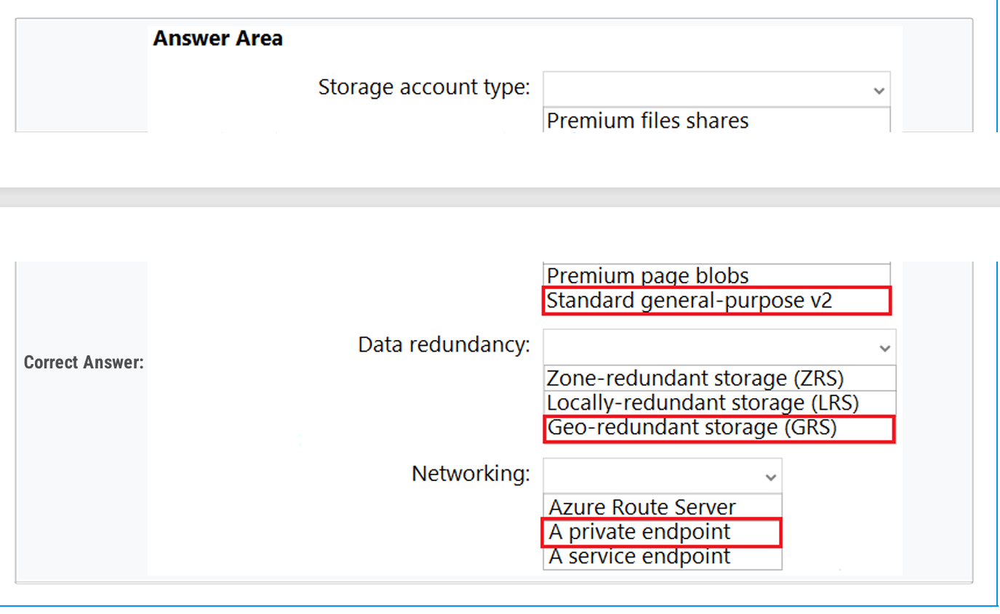
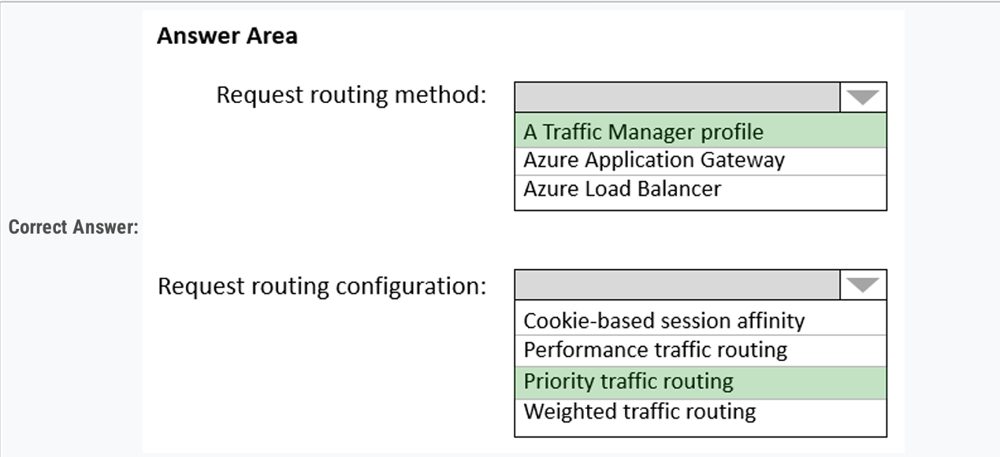
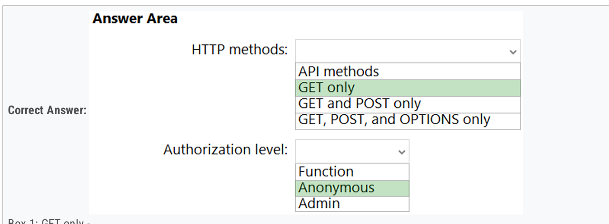
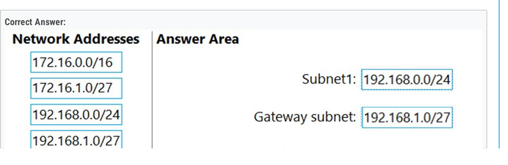
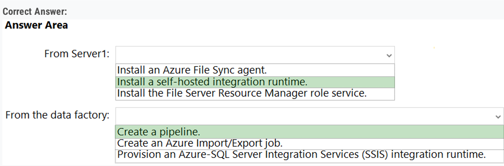
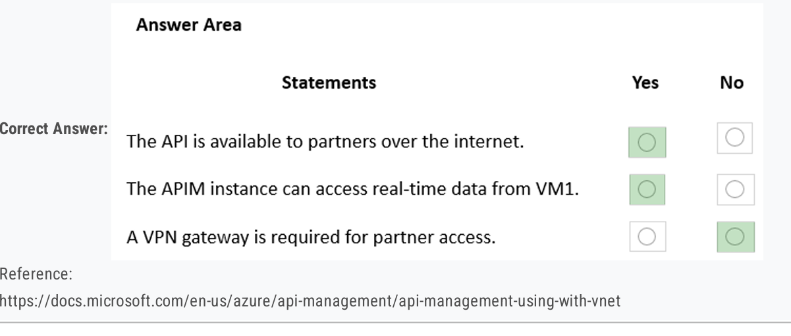
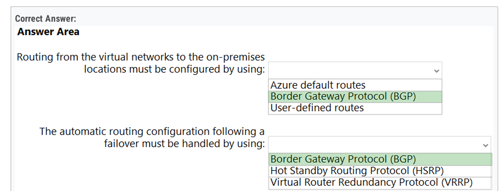

# AZ305 PART2

## Topic 4 - 127

## AAD

3、AAD

The on-premises Active Directory domain syncs with Azure Active Directory (Azure AD).  Server1 runs an application named App1 that uses LDAP queries to verify user identities in the on-premises Active Directory domain.  

You plan to migrate Server1 to a virtual machine in Subscription1.  

A company security policy states that the virtual machines and services deployed to Subscription1 must be prevented from accessing the on-premises network.  

You need to recommend a solution to ensure that App1 continues to function after the migration. The solution must meet the security policy. 

D. Azure AD Domain Services (Azure AD DS)

## Storage

21、STORAGE

You plan to provision an Azure Storage account to host the files.  You need to ensure that the storage account meets the following requirements:  Supports video files o**f up to 7 TB**  

Provides the highest availability possible  

Ensures that storage is **optimized for the large video files**  

Ensures that files from the on-premises network are uploaded by using ExpressRoute.

## APP

2、APP

Runs the script once an hour to **identify whether duplicate files exist**  

Sends an email notification to the operations manager requesting approval to **delete the duplicate files**  

Processes an email response from the operations manager specifying whether the **deletion was approved**

B. Azure Logic Apps and Azure Functions

4、APP

You need to design a solution that wi l execute custom C# code in response to an event routed to Azure Event Grid. The solution must meet the fo lowing requirements:  

The executed code must be able to access the private IP address of a Microsoft SQL Server instance that runs on an Azure virtual machine.  

Costs must be minimized. 

B. Azure Functions in the Premium plan

10、APP

You have a .NET web service named Service1 that performs the fo lowing tasks:  Reads and writes temporary files to the local file system.  Writes to the Application event log.  You need to recommend a solution to host Service1 in Azure. The solution must meet the fo lowing requirements:  Minimize maintenance overhead.  Minimize costs. 

A. an Azure App Service web app

16、APP

You are designing an Azure App Service web app.  You plan to deploy the web app to the North Europe Azure region and the West Europe Azure region.  You need to recommend a solution for the web app. The solution must meet the fo lowing requirements:  

Users must always access the web app from the North Europe region, unless the region fails.  

The web app must be available to users if an Azure region is unavailable.  

Deployment costs must be minimized. 

## DB

12、DB

App1 and the data are used on the first day of the month only. The data is not expected to grow more than 3 percent each year.  The company is rewriting App1 as an Azure web app and plans to migrate a l the data to Azure.  You need to migrate the data to Azure SQL Database and ensure that the database is only available on the first day of each month.  Which service tier should you use? 

A. vCore-based General Purpose

## Policy

23、POLICY

You need to recommend a solution to provide developers with the ability to provision Azure virtual machines. The solution must meet the fo lowing requirements:  

Only a low the creation of the virtual machines in specific regions.  

Only a low the creation of specific sizes of virtual machines. 

B. Azure Policy

## Monitor

## KV/MI

## VM

5、 vm

You have an on-premises network and an Azure subscription. The on-premises network has several branch offices.  A branch office in Toronto contains a virtual machine named VM1 that is configured as a file server. Users access the shared files on VM1 from a l the offices.  You need to recommend a solution to ensure that the users can access the shared files as quickly as possible if the Toronto branch office is inaccessible. 

D. an Azure file share and Azure File Sync

14、VM

Your company has 300 virtual machines hosted in a VMware environment. The virtual machines vary in size and have various utilization levels.  You plan to move a l the virtual machines to Azure.  You need to recommend how many and what size Azure virtual machines wi l be required to move the current workloads to Azure. The solution must minimize administrative effort. 

C. Azure Migrate

## Network

1、network

You have an ExpressRoute circuit in the US East Azure region.  You need to create an ExpressRoute association to VirtualWAN1. 

Upgrade VirtualWAN1 to Standard. 

6、network

You have an Azure subscription named Subscription1 that is linked to a hybrid Azure Active Directory (Azure AD) tenant.  You have an on-premises datacenter that does NOT have a VPN connection to Subscription1. The datacenter contains a computer named Server1 that has  Microsoft SQL Server 2016 insta led. Server is prevented from accessing the internet.  

An Azure logic app resource named LogicApp1 requires write access to a database on Server1.  You need to recommend a solution to provide LogicApp1 with the ability to access Server1.  

What should you recommend deploying on-premises and in Azure? 

On premise: An On-premise data gateway

Azure: A connection gateway resource

8、NETWORK

Azure Service:  Azure pplication gateway

Feature: WAF

9、NETWORK

You need to design a solution to expose the microservices to the consumer apps. The solution must meet the fo lowing requirements:  Ingress access to the microservices must be restricted to a single private IP address and protected by using mutual TLS authentication.  The number of incoming microservice ca ls must be rate-limited.  Costs must be minimized. 

D. Azure API Management Premium tier with virtual network connection

11、NETWORK

What is the minimum number of additional Azure Firewa l policies you should create? 

D. 3

17、NETWORK

You need to design an access solution for the app. The solution must meet the fo lowing replication requirements:  Support rate limiting.  Balance requests between a l instances.  Ensure that users can access the app in the event of a regional outage.  

Solution: **You use Azure Traffic Manager to provide access to the app.** 

NO

18、SAME TO 17

Solution: You use **Azure Load Balancer** to provide access to the app. 

NO

19、SAME TO 17

Solution: You use **Azure Application Gateway** to provide access to the app.

NO

22、NETWORK

24、NETWORK

27、NETWORK

Your on-premises network contains a file server named Server1 that stores 500 GB of data.  

You need to use Azure Data Factory to copy the data from Server1 to Azure Storage.  

You add a new data factory. 

## 其他

7、APIM

13、Service Bus

 You are developing a sales application that wi l contain several Azure cloud services and handle different components of a transaction. Different cloud services wi l process customer orders, bi ling, payment, inventory, and shipping.  You need to recommend a solution to enable the cloud services to asynchronously communicate transaction information by using XML messages.  What should you include in the recommendation? 

 C. Azure Service Bus

15、

 High Performance Computing (HPC) cluster in Azure that wi l use a third-party scheduler.

B. Azure CycleCloud

20、NETWORK BGP

Each on-premises site has ExpressRoute Global Reach circuits to both regions.  You need to recommend a solution that meets the fo lowing requirements:  Outbound traffic to the internet from workloads hosted on the virtual networks must be routed through the closest available on-premises site.  If an on-premises site fails, traffic from the workloads on the virtual networks to the internet must reroute automatica ly to the other site. 

25、ADF

You have data files in Azure Blob Storage.  

You plan to transform the files and move them to Azure Data Lake Storage.  

You need to transform the data by using mapping data flow. 

C. Azure Data Factory

26、AKS

You need to deploy an Azure Kubernetes Service (AKS) solution that wi l use Windows Server 2019 nodes. The solution must meet the fo lowing requirements:  

Minimize the time it takes to provision compute resources during scale-out operations.  

Support autoscaling of Windows Server containers. 

 C. cluster autoscaler

## here

28、

29、

30、

31、

32、

33、

34、

35、

36、

37、

38、

39、

69、

70、

71、

72、

73、

74、

75、

76、

77、

78、

79、

80、

81、

82、

83、

84、

85、

86、

87、

88、

89、

90、

91、

92、

93、

94、

95、

96、

97、

98、

99、

## Topic 5 - 2

## Topic 6 - 4

## Topic 7 - 2

## Topic 8 - 5

## Topic 9 - 3

## Topic 10 - 2

## Topic 11 - 1

## Topic 12 - 1

## Topic 13 - 2

## Topic 14 - 1

## Topic 15 - 1

## Topic 16 - 1

