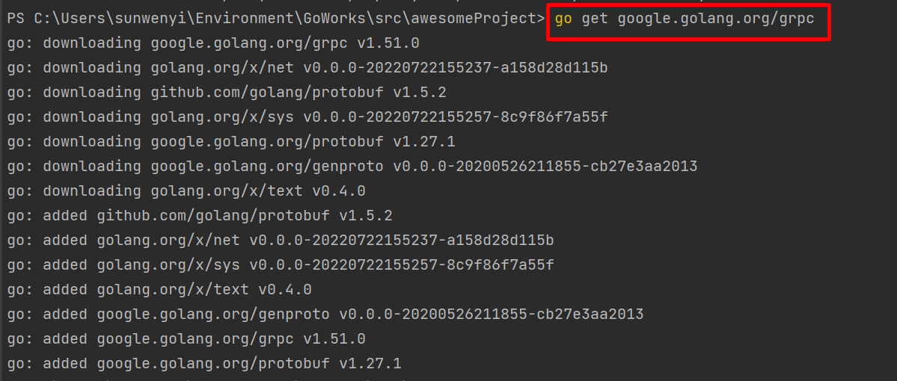
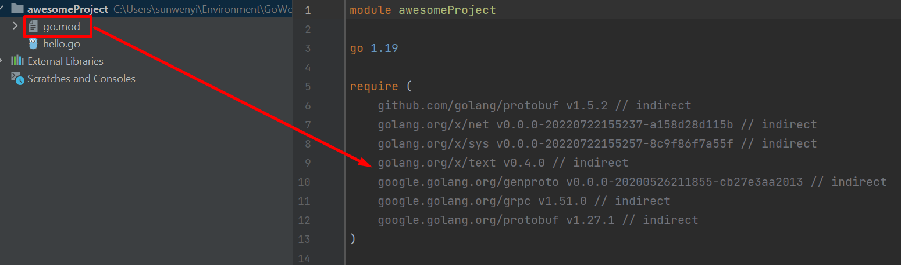

# GRPC


http://grpc.io/

http://doc.oschina.net/grpc


```bash
go get google.golang.org/grpc
```


记得要开启VPN下载。







```bash
go install google.golang.org/protobuf/cmd/protoc-gen-go@latest
go: downloading google.golang.org/protobuf v1.28.1


go install google.golang.org/grpc/cmd/protoc-gen-go-grpc@latest
go: downloading google.golang.org/grpc/cmd/protoc-gen-go-grpc v1.2.0

```


```bash
PS C:\Users\sunwenyi\Environment\GoWorks\src\awesomeProject> cd .\hello-server\
PS C:\Users\sunwenyi\Environment\GoWorks\src\awesomeProject\hello-server> cd .\proto
PS C:\Users\sunwenyi\Environment\GoWorks\src\awesomeProject\hello-server\proto> protoc --go_out=. hello.proto

PS C:\Users\sunwenyi\Environment\GoWorks\src\awesomeProject\hello-server\proto> protoc --go-grpc_out=. hello.proto

```


